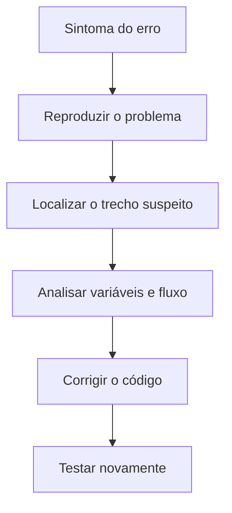
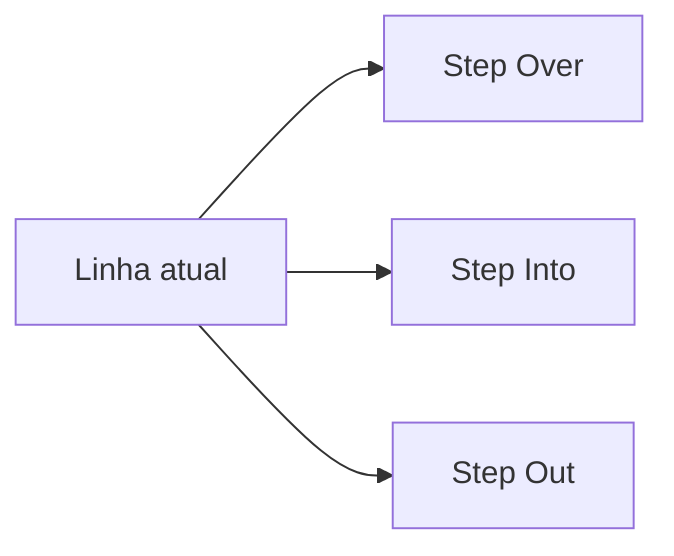
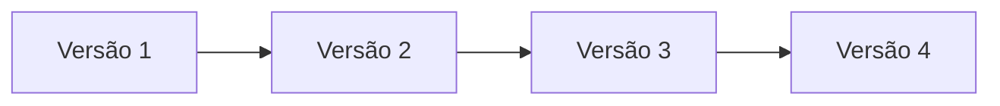
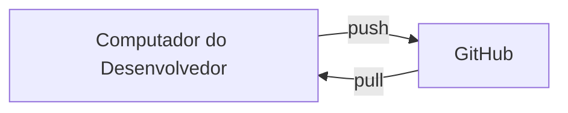
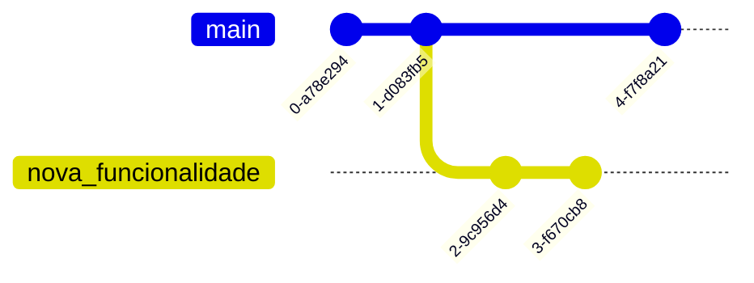
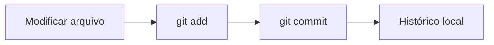
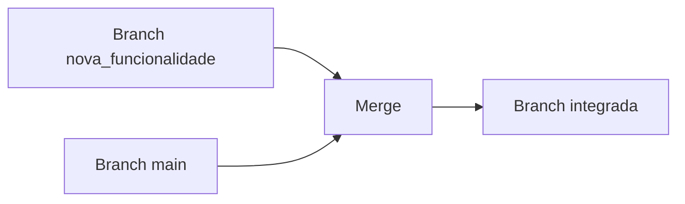
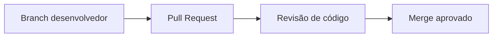

# Depuração e Versionamento

### Unidade 3 | Capítulo 3 — Sistemas Embarcados

---

## Depuração e Versionamento

**Unidade:** Sistemas Embarcados
**Capítulo:** Ferramentas de Desenvolvimento

A construção de firmware confiável depende de duas capacidades fundamentais:

* **Depurar código**
* **Controlar versões do projeto**

Em sistemas embarcados, essas práticas são ainda mais importantes porque o software interage diretamente com hardware físico.

**Exemplos típicos:**

* sensores que não respondem
* periféricos configurados incorretamente
* erros de temporização
* regressões após alterações no firmware

Sem depuração e versionamento, a evolução do projeto pode se tornar caótica.

---

# Introdução

No desenvolvimento de software moderno, duas ferramentas estruturam o fluxo de trabalho do programador:

* **Ferramentas de depuração**
* **Sistemas de controle de versão**

## Depuração

A depuração permite **executar o código de forma controlada**, observando o que acontece em cada etapa da execução.

Isso permite:

* identificar erros
* analisar variáveis
* acompanhar fluxo de execução

## Versionamento

O versionamento resolve outro problema fundamental:

**como gerenciar a evolução de um projeto ao longo do tempo**

Ele permite:

* registrar todas as alterações
* recuperar versões anteriores
* trabalhar em equipe sem sobrescrever código

---

# O Processo de Depuração

Depurar não é apenas "testar código".
É um **processo sistemático de investigação**.

Fluxo típico de depuração:



## Etapas práticas

### 1 — Entender o sintoma

Exemplo:

* LED deveria piscar a cada 1 segundo
* mas pisca a cada 100 ms

Pergunta chave:

**o erro é de lógica ou temporização?**

---

### 2 — Localizar a causa

Examinar:

* condições
* loops
* cálculos
* inicialização de variáveis

---

### 3 — Corrigir

Modificar apenas o trecho necessário.

---

### 4 — Testar novamente

O objetivo é garantir que:

* o bug foi corrigido
* nenhum novo bug foi introduzido

---

# Facilitando a Depuração

Depuração eficiente começa **antes do bug existir**.

Código bem estruturado reduz drasticamente o tempo de investigação.

## Princípios de Clean Code

Boas práticas:

* nomes claros de variáveis
* funções pequenas
* responsabilidades únicas
* lógica simples

### Exemplo ruim

```c
int a(int b){
if(b>5){return b*3;}else{return b+2;}
}
```

### Exemplo melhor

```c
int calcular_valor_sensor(int leitura){
    if(leitura > LIMIAR_SENSOR){
        return leitura * FATOR_ESCALA;
    }
    return leitura + OFFSET_CALIBRACAO;
}
```

---

## Depuração em pares

Técnica muito utilizada em equipes.

Fluxo:

1. Programador explica o problema
2. Colega questiona hipóteses
3. Nova perspectiva revela o erro

Frequentemente o bug aparece **durante a explicação**.

---

# Depuração na Prática (VS Code)

Ambientes modernos possuem ferramentas de depuração integradas.

No **VS Code**, três recursos são fundamentais:

* Breakpoints
* Watch
* Execução passo a passo

---

## Breakpoints

Breakpoint é um **ponto de pausa na execução**.

Quando o programa chega nessa linha:

* a execução é interrompida
* variáveis podem ser analisadas

Exemplo:

```c
int temperatura = ler_sensor();

if(temperatura > 30){
    ligar_ventilador();
}
```

Breakpoint na linha da condição.

Durante a execução podemos verificar:

```
temperatura = 27
```

Logo o ventilador não liga.

---

## Execução passo a passo

Fluxo de execução controlado.



### Step Over

Executa a linha atual **sem entrar na função**

### Step Into

Entra dentro da função chamada.

### Step Out

Sai da função atual e retorna ao chamador.

---

## Watch

Permite monitorar variáveis ou expressões.

Exemplo:

```
temperatura
contador
sensor_ativo
```

Valores atualizam automaticamente a cada passo.

---
##Pausa
---

#  O que é Versionamento

Projetos de software evoluem continuamente.

Sem versionamento ocorrem problemas como:

* perda de código
* sobrescrita de alterações
* dificuldade de rastrear erros

## Sistema de versionamento

Um sistema de versionamento:

* registra mudanças
* cria histórico
* permite recuperar estados antigos

---

## Funcionamento do Git

O Git trabalha com **snapshots do projeto**.



Cada snapshot registra:

* arquivos
* alterações
* autor
* data

---

# Conceitos Essenciais do Git

## Repositório

É a pasta que contém:

* código
* histórico
* metadados do Git

Estrutura típica:

```
projeto/
 ├── src/
 ├── include/
 ├── README.md
 └── .git/
```

---

## Repositório Local e Remoto



### Local

Onde o programador trabalha.

### Remoto

Servidor compartilhado.

Exemplo:

* GitHub
* GitLab
* Bitbucket

---

## Commit

Commit é um **registro permanente de alterações**.

Cada commit possui:

* ID único
* mensagem
* autor
* timestamp

---

## Branch

Branches permitem trabalhar em **linhas paralelas de desenvolvimento**.



---

# Fluxo Básico de Comandos Git

Fluxo local típico.



---

## Passo a passo prático

### 1 — Criar repositório

```bash
git init
```

Resultado:

```
Initialized empty Git repository
```

---

### 2 — Adicionar arquivos

```bash
git add main.c
```

Ou todos:

```bash
git add .
```

Arquivos vão para o **staging area**.

---

### 3 — Criar commit

```bash
git commit -m "Implementa leitura do sensor"
```

O commit registra a alteração.

---

# Sincronização e Colaboração

Quando trabalhamos em equipe precisamos sincronizar repositórios.

---

## Enviar alterações

```bash
git push
```

Fluxo:

```
Repositório local → Repositório remoto
```

---

## Atualizar repositório local

```bash
git pull
```

Fluxo:

```
Repositório remoto → Repositório local
```

---

## Integração de branches

```bash
git merge nova_funcionalidade
```

Resultado:



---

## Pull Request

Fluxo típico em plataformas como GitHub.



Vantagens:

* revisão técnica
* qualidade de código
* rastreabilidade

---

# Conclusão

Depuração e versionamento são **competências estruturais do desenvolvimento moderno**.

Sem elas:

* erros se acumulam
* projetos se tornam instáveis
* colaboração se torna inviável

Com elas:

* bugs são identificados rapidamente
* histórico do projeto é preservado
* equipes trabalham de forma organizada

Em sistemas embarcados isso se torna ainda mais crítico, pois o software controla **hardware físico real**.

O domínio dessas ferramentas permite desenvolver:

* firmware mais confiável
* sistemas mais robustos
* projetos escaláveis.
