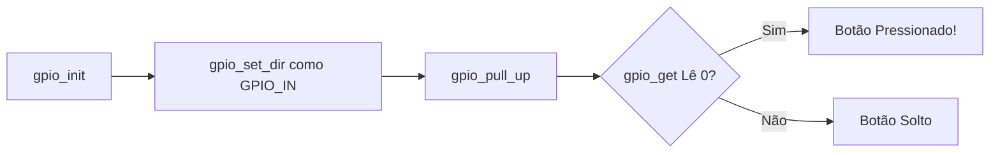
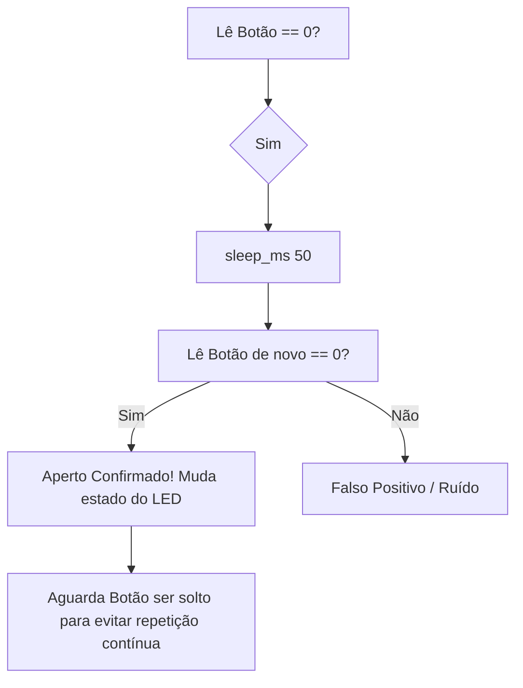

# Entradas e Saídas

**GPIOs, LEDs, Botões e o Efeito Bounce**
---

## O que é um GPIO? (General Purpose Input/Output)

* **Revisão:** Na última aula simulamos sensores com variáveis aleatórias. Hoje, vamos ler tensão elétrica real!
* **O Conceito:** GPIOs são os "tentáculos" do microcontrolador RP2040. Pinos que podem ser configurados via software para:
* **Saída (Output):** Enviar energia (3.3V = `HIGH` / 1) ou cortar energia (0V = `LOW` / 0). Ex: Ligar um LED.
* **Entrada (Input):** "Ouvir" se há energia (3.3V) ou não (0V) chegando de fora. Ex: Ler um botão.


---

## O "Hello World" do Hardware (20 min)

**Configurando uma Saída Digital (Controlando o LED Vermelho)**

* **O Problema:** Como o código faz a eletricidade chegar até o LED RGB da BitDogLab?
* **(SDK):**
1. `gpio_init(PINO)`: Acorda o pino.
2. `gpio_set_dir(PINO, GPIO_OUT)`: Define como saída.
3. `gpio_put(PINO, ESTADO)`: Manda 1 (liga) ou 0 (desliga).


* **Hipótese:** Se usarmos o pino 12 (LED Vermelho) num `while(true)`, o que acontece?

**O Código (Firmware):**

```c
#include "pico/stdlib.h"

#define LED_R_PIN 12 // Pino do LED Vermelho na BitDogLab

int main() {
    gpio_init(LED_R_PIN);
    gpio_set_dir(LED_R_PIN, GPIO_OUT);

    while (true) {
        gpio_put(LED_R_PIN, 1); // Liga o LED
        sleep_ms(500);
        gpio_put(LED_R_PIN, 0); // Desliga o LED
        sleep_ms(500);
    }
}

```

---

## Lendo sinais externos

**Ler um Botão (Entrada Digital)**

* **O Problema:** Um botão é apenas um pedaço de metal que une dois fios. Como o RP2040 sabe se ele foi apertado?


* **Resistores de Pull-up:** O microcontrolador não gosta de pinos "flutuando". Usamos `gpio_pull_up()` para forçar o pino a ler `HIGH` (1) quando o botão está solto. Quando apertamos, ele conecta ao GND e lê `LOW` (0).

**Fluxo de Configuração:**



---

## Interação Direta

**Botão A (GPIO 5) Controlando o LED Vermelho (GPIO 12)**

* **A Missão:** Juntar o Experimento 1 com a leitura do botão.
* **O Código (Firmware):**

```c
#include "pico/stdlib.h"

#define LED_R_PIN 12
#define BTN_A_PIN 5 // Pino do Botão A na BitDogLab

int main() {
    gpio_init(LED_R_PIN);
    gpio_set_dir(LED_R_PIN, GPIO_OUT);

    gpio_init(BTN_A_PIN);
    gpio_set_dir(BTN_A_PIN, GPIO_IN);
    gpio_pull_up(BTN_A_PIN); 

    while (true) {
        if (gpio_get(BTN_A_PIN) == 0) { 
            gpio_put(LED_R_PIN, 1); // Aperta, liga
        } else {
            gpio_put(LED_R_PIN, 0); // Solta, desliga
        }
    }
}

```

---

## O Efeito Bounce (Repique Mecânico)

* **O Problema:** Dentro do botão há uma mola metálica. Quando apertada, ela "quica" microscopicamente antes de estabilizar.
* **A Consequência:** Para o chip, um aperto humano parece 20 apertos em milissegundos!
* **A Solução (Debounce):** Mandar o código "esperar" uns 50 milissegundos para o contato físico estabilizar.

---

## Derrotando o Bounce

**Implementando o Debounce no Código**

* **O Algoritmo de Debounce Simples:**



---

## Atividade sugerida

**Máquina de Estados: Botões A/B e Led RGB**

Agora é com vocês!

**Requisitos do Sistema na BitDogLab:**

* **LED RGB:** Vermelho (12), Verde (13) e Azul (11).
* **Botões:** A (5) e B (6).
* **Ação do Botão A:** Pressionado (com Debounce!), avança o estado:
* Estado 0: Todos apagados.
* Estado 1: Liga apenas Vermelho (12).
* Estado 2: Liga apenas Verde (13).
* Estado 3: Liga apenas Azul (11). (Apertar novamente volta pro 0).


* **Ação do Botão B:** Botão de emergência! Quando pressionado, zera a máquina (Estado 0) apagando tudo instantaneamente.
