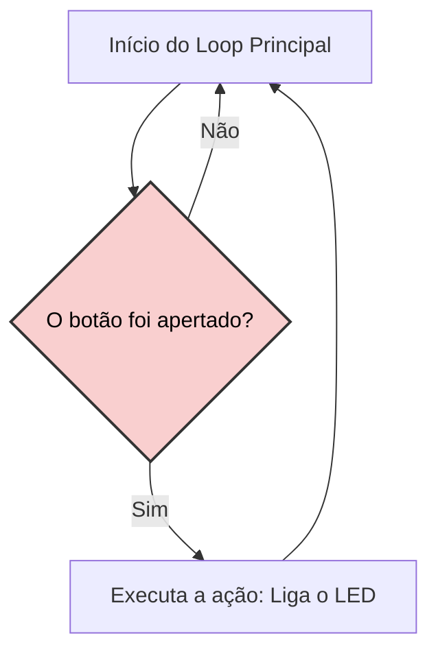
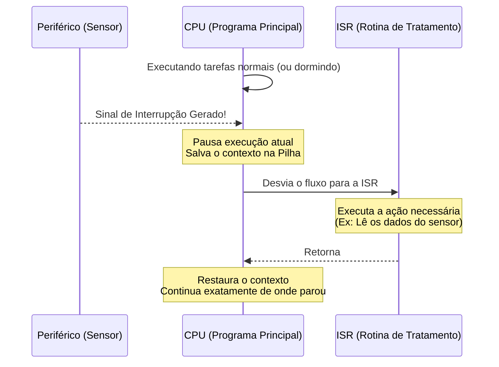
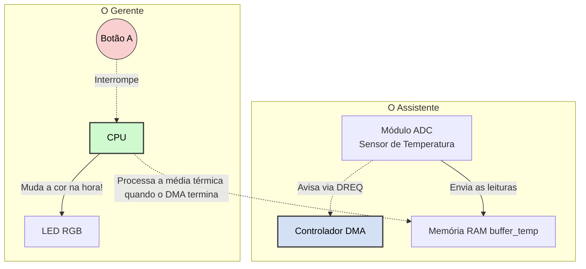
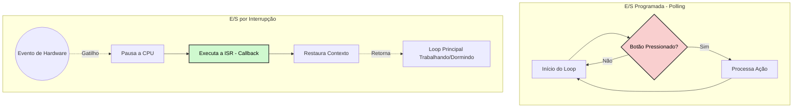
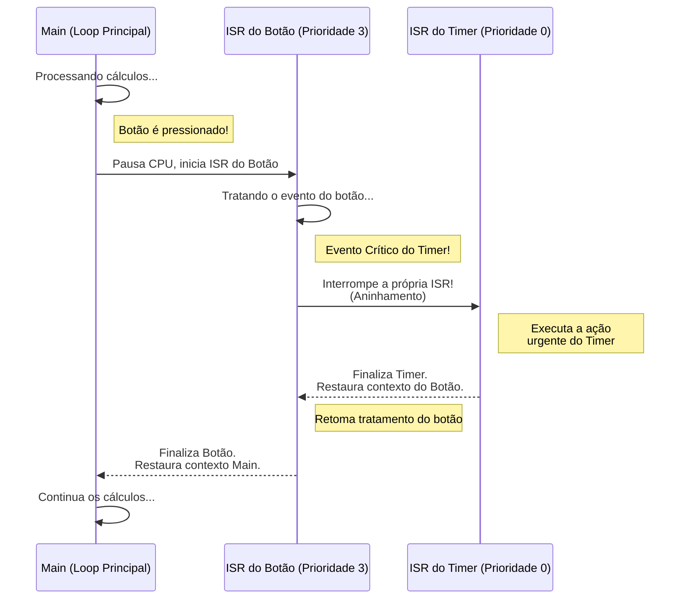
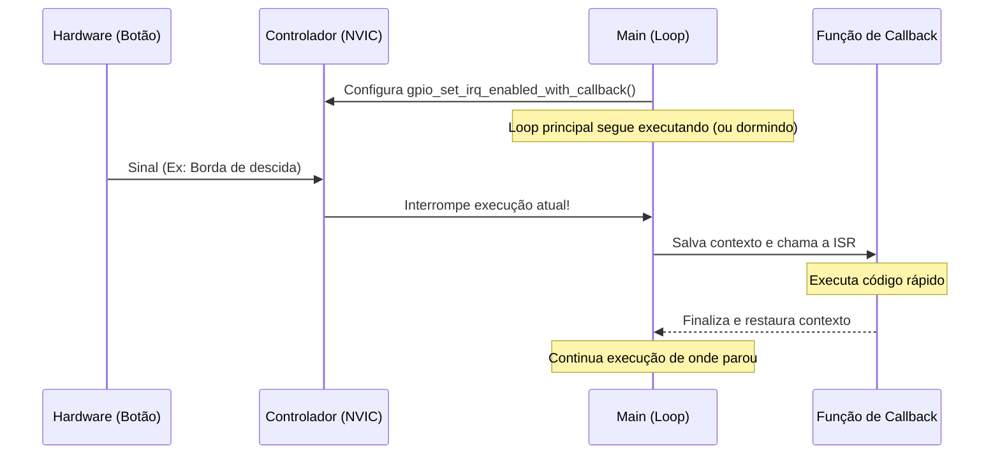
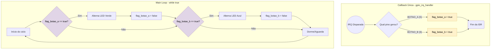

## Interrupções em Sistemas Embarcados
**Unidade 4 | Capítulo 4**

* **Tópicos:** Introdução ao mecanismo de interrupções, configuração no módulo GPIO (RP2040) e prática com BitDogLab.
---

## Objetivos

* **Compreender** o funcionamento do mecanismo de interrupções e suas vantagens.
* **Configurar** o módulo de interrupções e rotinas de tratamento de interrupções (ISRs) no RP2040.
* **Desenvolver** código prático utilizando a SDK C/C++ da Pico W no VS Code.
* **Resolver** problemas em tempo real utilizando a BitDogLab.

---

## Técnicas de Entrada e Saída (E/S)

Como o microcontrolador "lê" o mundo externo?

Para entender como um microcontrolador interage com o mundo externo, precisamos estudar três principais técnicas de Entrada e Saída (E/S). 

---

### 1. E/S Programada (Polling)
No **Polling**, o processador atua de forma ativa e síncrona. Ele toma a iniciativa de perguntar, repetidas vezes, qual é o estado atual do periférico.

* **A Analogia da Viagem de Carro:** Imagine uma viagem de carro para um destino tão tão distante, com um burro falante no banco de trás. A burro pergunta a cada 5 segundos: *"A gente já chegou?"*. O motorista (CPU) gasta uma quantidade enorme de energia e foco apenas para verificar a condição (chegar ao destino), impedindo que ele relaxe ou preste atenção em outras coisas.
* **Exemplo de Aplicação:** Um projeto muito simples de semáforo onde a placa só precisa acender LEDs sequencialmente e verificar se um botão de pedestre foi apertado. Como o sistema não tem mais nada para fazer, o *polling* é aceitável.
* **Vantagens:** Extremamente simples de programar (um simples `if` dentro de um `while(true)`).
* **Desvantagens:** Desperdício imenso de ciclos de processamento e consumo de energia elevado, pois a CPU nunca "descansa".


**Fluxograma de Execução (Polling):**


# Código exemplo:

````C
#include <stdio.h>
#include "pico/stdlib.h"

// Definindo os pinos
#define PINO_BOTAO 5 // O "Burro falante"
#define PINO_LED 11  // O destino "Tão Tão Distante"

int main() {
    // Inicializa a comunicação padrão
    stdio_init_all();

    // Uma pequena pausa inicial para dar tempo de você abrir o terminal serial
    sleep_ms(2000);

    // Configura o pino do LED como saída
    gpio_init(PINO_LED);
    gpio_set_dir(PINO_LED, GPIO_OUT);

    // Configura o pino do botão como entrada com resistor Pull-Up interno
    // Com o Pull-Up, o botão lerá "1" (HIGH) quando solto e "0" (LOW) quando pressionado
    gpio_init(PINO_BOTAO);
    gpio_set_dir(PINO_BOTAO, GPIO_IN);
    gpio_pull_up(PINO_BOTAO);

    // Trava elegante para aguardar o terminal serial abrir
    while (!stdio_usb_connected()) {
        sleep_ms(100);
    }

    printf("Iniciando a viagem para Tão Tão Distante...\n");

    // O Loop Infinito da Viagem (Polling)
    while (true) {
        
        // Verifica o estado do botão
        if (gpio_get(PINO_BOTAO) == 0) { 
            // Sim! O botão foi pressionado. (LOW)
            gpio_put(PINO_LED, 1); // Acende o LED
            printf("Chegamos!!! Finalmente paz e sossego.\n");
            
            // "Para" o microcontrolador
            // Em sistemas embarcados, não usamos "exit(0)" como no PC. 
            // Para interromper a execução, nós o prendemos em um loop infinito sem fazer nada.
            while (true) {
                sleep_ms(1000); // Apenas dorme eternamente com o LED aceso
            }
            
        } else {
            // Não, ainda não chegamos. (HIGH)
            gpio_put(PINO_LED, 0); // Garante que o LED fique apagado
            printf("A gente já chegou?\n");
            
            // Pausa de 1 segundo para o Burro não perguntar rápido demais 
            // e travar a porta serial do seu computador
            sleep_ms(1000); 
        }
        
    }

    return 0;
}
````

---

### 2. E/S Controlada por Interrupção (Interrupts)
Aqui o processador não "pergunta" mais; ele é **interrompido** pelo hardware quando algo importante acontece.

* **A Analogia do Micro-ondas:** Você coloca o prato no micro-ondas, digita 3 minutos e aperta "Ligar". Em vez de ficar olhando fixamente para o prato girando (Polling), você vai para a sala ler um livro (CPU executando outra tarefa ou "dormindo"). Quando o tempo acaba, o micro-ondas **apita** (gera uma interrupção). Você pausa sua leitura, vai até a cozinha, tira o prato (trata a interrupção) e depois volta a ler exatamente da página onde parou (restaura o contexto).
* **Exemplo de Aplicação:** Um sistema de alarme IoT (Internet das Coisas) movido a bateria. O processador passa 99% do tempo em modo *Deep Sleep*, consumindo pouquissima energia. Quando um sensor de movimento detecta presença, ele envia um sinal elétrico que "acorda" o processador via interrupção apenas para enviar um alerta Wi-Fi e voltar a dormir.
* **Vantagens:** Alta eficiência energética e capacidade de resposta quase instantânea a eventos críticos.
* **Desvantagens:** Maior complexidade no código. Exige cuidado com variáveis compartilhadas (uso de `volatile`) e problemas de concorrência.


**Diagrama de Sequência (Interrupção):**


# Código exemplo:

````C
#include <stdio.h>
#include "pico/stdlib.h"

// Definindo os pinos
#define PINO_BOTAO 5 // O botão do nosso "Micro-ondas"
#define PINO_LED 11  // A luz da cozinha para mostrar que levantamos

// Variável global VOLÁTIL que serve como "sinal" entre a interrupção e o loop principal.
// O "volatile" avisa ao compilador que essa variável pode mudar a qualquer momento no hardware.
volatile bool comida_pronta = false;

// -------------------------------------------------------------------------
// ROTINA DE TRATAMENTO DE INTERRUPÇÃO (ISR / Callback)
// Essa função é chamada AUTOMATICAMENTE pelo hardware quando o botão é apertado.
// É o "apito" do micro-ondas. Ela deve ser o mais rápida possível!
// -------------------------------------------------------------------------
void microondas_apita_callback(uint gpio, uint32_t events) {
    // Apenas sinalizamos que a comida está pronta e voltamos rápido para o que estávamos fazendo
    comida_pronta = true;
}

int main() {
    // Inicialização padrão
    stdio_init_all();

    // Trava elegante para aguardar o terminal serial abrir (como vimos antes)
    while (!stdio_usb_connected()) {
        sleep_ms(100);
    }

    printf("Terminal conectado! Fui para a sala ler um livro...\n");

    // Configura o LED
    gpio_init(PINO_LED);
    gpio_set_dir(PINO_LED, GPIO_OUT);
    gpio_put(PINO_LED, 0); // Começa apagado

    // Configura o Botão com Pull-Up
    gpio_init(PINO_BOTAO);
    gpio_set_dir(PINO_BOTAO, GPIO_IN);
    gpio_pull_up(PINO_BOTAO);

    // -------------------------------------------------------------------------
    // CONFIGURAÇÃO DA INTERRUPÇÃO
    // Dizemos ao NVIC: "Se o PINO_BOTAO for de HIGH para LOW (Borda de Descida), 
    // pause tudo e chame a função microondas_apita_callback".
    // -------------------------------------------------------------------------
    gpio_set_irq_enabled_with_callback(
        PINO_BOTAO, 
        GPIO_IRQ_EDGE_FALL, 
        true, 
        &microondas_apita_callback
    );

    // O Loop Principal da Vida (O que a CPU faz no seu tempo "livre")
    while (true) {
        
        // Verificamos a flag alterada pela interrupção
        if (comida_pronta) {
            printf("\n[INTERRUPÇÃO!] Opa, o micro-ondas apitou! Indo buscar a comida...\n");
            
            // Simula a ação de ir até a cozinha (Acende o LED)
            gpio_put(PINO_LED, 1);
            sleep_ms(2000); // Demora 2 segundos pegando a comida
            gpio_put(PINO_LED, 0); // Apaga a luz e volta
            
            printf("Comida deliciosa. Voltando para o meu livro...\n\n");
            
            // Reseta a flag para podermos ser interrompidos de novo no futuro
            comida_pronta = false; 
        }

        // Tarefa principal (lendo o livro)
        // A CPU não está perguntando pelo botão aqui! Ela está apenas vivendo a vida dela.
        printf("Lendo a página do livro...\n");
        sleep_ms(1500); // Lê uma página a cada 1.5 segundos
    }

    return 0;
}
````

---

### 3. Acesso Direto à Memória (DMA - Direct Memory Access)

O DMA é um **co-processador de hardware** dedicado exclusivamente a mover blocos de informações entre periféricos e a memória, tirando totalmente essa carga da CPU principal.

* Ler um sensor continuamente, fazendo leituras seguidas e calculando médias exige que a CPU fique presa em um loop (`for` ou `while`), impedindo-a de responder a outros eventos rapidamente.
* **A Solução :** A CPU configura o DMA dizendo: *"Colete 10 amostras de temperatura do ADC, guarde no vetor `buffer_temp` e só me avise quando terminar"*.
* **O Resultado:** A CPU fica 100% livre! No nosso exemplo, enquanto o DMA coleta a temperatura, a CPU consegue responder instantaneamente à interrupção do Botão A e trocar a cor do LED.

---

## Arquitetura do Sistema (DMA + Interrupção)
**Como o RP2040 divide o trabalho?**



---

## Configurando o DMA (Pico SDK)

Para usar o DMA, configuramos um "canal" com as regras de transporte:

```c
int configurar_dma(dma_channel_config *cfg) {
    int canal = dma_claim_unused_channel(true); // Pega um canal livre
    *cfg = dma_channel_get_default_config(canal);
    
    // Tamanho da "caixa": 16 bits (tamanho do dado do ADC)
    channel_config_set_transfer_data_size(cfg, DMA_SIZE_16);
    
    // De onde ler? Do mesmo lugar sempre (Registro do ADC)
    channel_config_set_read_increment(cfg, false); 
    
    // Onde gravar? Andar pelo vetor para salvar as 10 amostras
    channel_config_set_write_increment(cfg, true); 
    
    // Ritmo: Só transporte quando o ADC gritar que tem dado novo (DREQ)
    channel_config_set_dreq(cfg, DREQ_ADC);        
    
    return canal;
}
```

---

## O Loop Principal

A CPU gerenciando tudo

O `main` delega o trabalho pesado e foca no que importa:

```c
while (true) {
    // 1. CPU manda o DMA iniciar o trabalho!
    dma_channel_configure(canal_dma, &cfg, buffer_temp, &adc_hw->fifo, 10, true);
    adc_run(true); 

    // 2. Enquanto o DMA trabalha sozinho, a CPU cuida de outras coisas (ex: checar flags)
    while (dma_channel_is_busy(canal_dma)) {
        processar_eventos_pendentes(); // Checa se o botão foi apertado!
    }
    
    // 3. DMA terminou! CPU calcula a média das 10 leituras de uma vez só
    adc_run(false); 
    float temperatura = calcular_temperatura(buffer_temp, 10);
    
    printf("Temperatura processada: %.2f C\n", temperatura);
}
```

**Conclusão:** Sem o DMA, a CPU faria a leitura `1`, processaria, leitura `2`... atrasando o botão. Com o DMA, a CPU recebe as 10 leituras prontas "de bandeja".


* **Vantagens:** Desempenho extremo para fluxos contínuos e grandes volumes de dados (streaming de áudio, envio de imagens para displays de vídeo, comunicação de rede). Evita o engasgo da CPU principal.
* **Desvantagens:** Configuração inicial complexa. O programador precisa entender intimamente o funcionamento da memória e dos registradores (configurar o tamanho do dado em bits, endereços de origem e destino, e os sinais de *Data Request* - DREQ).


## Código exemplo:

````C
#include <stdio.h>
#include "pico/stdlib.h"
#include "hardware/adc.h"
#include "hardware/dma.h"
#include "hardware/gpio.h"

// -------------------------------------------------------------------------
// DEFINIÇÕES E VARIÁVEIS GLOBAIS
// -------------------------------------------------------------------------
#define PINO_BOTAO_A 5
#define LED_R 13
#define LED_G 11
#define LED_B 12

#define AMOSTRAS 10
uint16_t buffer_temp[AMOSTRAS]; 

volatile int estado_cor = 0;
volatile bool flag_mudou_cor = false;

// -------------------------------------------------------------------------
// FUNÇÕES DE CALLBACK (INTERRUPÇÃO)
// -------------------------------------------------------------------------
void botao_callback(uint gpio, uint32_t events) {
    estado_cor = (estado_cor + 1) % 3;
    gpio_put(LED_R, estado_cor == 0);
    gpio_put(LED_G, estado_cor == 1);
    gpio_put(LED_B, estado_cor == 2);
    
    flag_mudou_cor = true;
}

// -------------------------------------------------------------------------
// FUNÇÕES DE CONFIGURAÇÃO (SETUP)
// -------------------------------------------------------------------------
void configurar_pinos_e_interrupcao() {
    // LEDs
    gpio_init(LED_R); gpio_set_dir(LED_R, GPIO_OUT);
    gpio_init(LED_G); gpio_set_dir(LED_G, GPIO_OUT);
    gpio_init(LED_B); gpio_set_dir(LED_B, GPIO_OUT);
    
    // Botão
    gpio_init(PINO_BOTAO_A);
    gpio_set_dir(PINO_BOTAO_A, GPIO_IN);
    gpio_pull_up(PINO_BOTAO_A);

    // Habilita interrupção
    gpio_set_irq_enabled_with_callback(PINO_BOTAO_A, GPIO_IRQ_EDGE_FALL, true, &botao_callback);
    
    // Estado inicial
    gpio_put(LED_R, 1);
}

void configurar_adc_temperatura() {
    adc_init();
    adc_set_temp_sensor_enabled(true); 
    adc_select_input(4);               
    adc_fifo_setup(true, true, 1, false, false);
    adc_set_clkdiv(4800000); 
}

int configurar_dma(dma_channel_config *cfg) {
    int canal = dma_claim_unused_channel(true);
    *cfg = dma_channel_get_default_config(canal);
    
    channel_config_set_transfer_data_size(cfg, DMA_SIZE_16);
    channel_config_set_read_increment(cfg, false); 
    channel_config_set_write_increment(cfg, true); 
    channel_config_set_dreq(cfg, DREQ_ADC);        
    
    return canal;
}

// -------------------------------------------------------------------------
// FUNÇÕES DE LÓGICA DO NEGÓCIO E AUXILIARES
// -------------------------------------------------------------------------
float calcular_temperatura_celsius(uint16_t *buffer, int qtd_amostras) {
    uint32_t soma = 0;
    for (int i = 0; i < qtd_amostras; i++) {
        soma += buffer[i];
    }
    float media_adc = (float)soma / qtd_amostras;
    float tensao = media_adc * (3.3f / 4095.0f);
    
    // Fórmula do RP2040
    return 27.0f - ((tensao - 0.706f) / 0.001721f);
}

void processar_eventos_pendentes() {
    // Se a interrupção levantou a bandeira, fazemos o print pesado aqui
    if (flag_mudou_cor) {
        printf("\n[MAIN] Botao pressionado! Cor alterada (Estado: %d).\n", estado_cor);
        flag_mudou_cor = false; 
    }
}

// -------------------------------------------------------------------------
// FUNÇÃO PRINCIPAL (MAIN)
// -------------------------------------------------------------------------
int main() {
    // Inicialização do Sistema
    stdio_init_all();
    
    // Trava elegante para aguardar o terminal serial abrir (como vimos antes)
    while (!stdio_usb_connected()) {
        sleep_ms(100);
    }

    printf("--- Monitor de Temperatura com DMA e Interrupcoes ---\n\n");

    // Configurações usando os módulos criados
    configurar_pinos_e_interrupcao();
    configurar_adc_temperatura();
    
    dma_channel_config cfg;
    int canal_dma = configurar_dma(&cfg);

    // Loop Principal
    while (true) {
        
        // 1. Inicia o DMA para ler as amostras
        dma_channel_configure(canal_dma, &cfg, buffer_temp, &adc_hw->fifo, AMOSTRAS, true);
        adc_run(true); 

        // 2. Aguarda o DMA terminar, mas checando eventos (Botão) ativamente
        while (dma_channel_is_busy(canal_dma)) {
            processar_eventos_pendentes();
        }
        
        // Finaliza ciclo do ADC
        adc_run(false); 
        adc_fifo_drain(); 

        // 3. Processa e imprime os dados capturados
        float temperatura = calcular_temperatura_celsius(buffer_temp, AMOSTRAS);
        printf("Media de %d amostras calculada via DMA! Temperatura: %.2f C\n", AMOSTRAS, temperatura);
        
        // 4. Pausa não-bloqueante (1 segundo dividido em 100 partes de 10ms)
        for(int i = 0; i < 100; i++) {
            processar_eventos_pendentes();
            sleep_ms(10); 
        }
    }

    return 0;
}
````

---

## Comparativo Polling vs. Interrupção

**Exemplo de Polling (Gasto de CPU):**
```c
// A CPU fica presa aqui perdendo tempo
while (true) {
    if (gpio_get(BOTAO_PIN) == 0) {
        liga_led();
    }
}
```

**Exemplo Conceitual de Interrupção (Eficiência):**
```c
// A CPU fica livre para dormir ou fazer cálculos
void campainha_tocou() {
    liga_led();
}
// Configuração feita apenas uma vez
```

**Fluxograma Comparativo:**


---

## Como Funciona o Mecanismo de Interrupção?

1. **Gatilho:** O periférico gera o sinal de interrupção de hardware.
2. **Pausa:** O processador finaliza a instrução atual e salva o **contexto de execução** (variáveis de estado) na pilha (Stack).
3. **Desvio:** O processador carrega o endereço do vetor de interrupções e chama a Rotina de Tratamento (**ISR** / Callback).
4. **Retorno:** Após tratar o evento, o processador restaura o contexto e retoma a tarefa anterior exatamente de onde parou.

---

## Interrupções no Microcontrolador RP2040

Para compreendermos como o microcontrolador RP2040, organiza quando múltiplas interrupções acontecem ao mesmo tempo. precisamos conhecer o **NVIC**.

### O Módulo NVIC 
O **NVIC** (*Nested Vectored Interrupt Controller*) é um subsistema de hardware embutido no núcleo ARM Cortex-M0+ do RP2040. Ele funciona como uma central inteligente entre os periféricos e o processador.

* O processador (CPU) só pode atender uma interrupção por vez. O NVIC é o responsável pela triagem das inerrupções. Quando os eventos de hardware chegam, o NVIC avalia a prioridade de cada um e organiza a fila. O processador não precisa conferir quem chegou; o NVIC simplesmente coloca o evento mais prioritário na frente.

O NVIC faz essa organização em nível de hardware, ou seja, de forma praticamente instantânea (em poucos ciclos de clock), sem gastar processamento da CPU para decidir quem deve ser atendido.


### Fontes de Interrupção
O RP2040 é capaz de gerenciar até **26 fontes diferentes de interrupção** simultaneamente e 32 fonte no total. Cada tipo de periférico possui sua própria "linha direta" (IRQ - *Interrupt Request*) com o NVIC.

* **Exemplos de Fontes:**
    * **GPIO:** Um botão foi pressionado (IRQ do pino).
    * **UART / I2C / SPI:** O módulo de comunicação avisa: "Recebi um novo pacote de dados do sensor!"
    * **Timers:** "Passou exatamente 1 milissegundo desde a última vez, hora de atualizar o display!"
    * **PWM:** "Terminei um ciclo de onda."

### Níveis de Prioridade e Regras de Desempate
O RP2040 permite configurar **4 níveis de prioridade** (0 a 3). Na arquitetura ARM, geralmente, o número **menor** indica a prioridade **maior** (Nível 0 é a prioridade máxima, Nível 3 é a mínima).

* **A Analogia do Embarque no Aeroporto:** Pense nas filas de embarque de um voo.
    * *Prioridade 0 (Diamante/Emergência)*: Passa na frente de todos.
    * *Prioridade 3 (Econômica/Eventos Comuns)*: Só embarca se as outras filas estiverem vazias.
* **O Desempate (Tie-breaker):** E se dois eventos com a mesma prioridade (ex: dois passageiros da classe Econômica) chegarem no exato mesmo nanossegundo? O hardware consulta a tabela fixa de IRQs do RP2040 (que vai de 0 a 25). A interrupção com o **menor número de IRQ na tabela** ganha a corrida.

### 4. Interrupções Aninhadas
A palavra "Nested" (Aninhada) no nome do NVIC significa que **uma interrupção pode ser interrompida por outra interrupção** – desde que a nova seja mais urgente (prioridade maior).

* **A Analogia do Incêndio na Cozinha:**
   1. Você está na sala assistindo TV (Loop Principal).
   2. A campainha toca. Você pausa a TV e vai atender o entregador de pizza (Interrupção de Prioridade Baixa).
   3. Enquanto você está pagando a pizza, a panela no fogão começa a pegar fogo! (Interrupção de Prioridade Máxima).
   4. Você larga a máquina de cartão com o entregador (salva o contexto da ISR 1), corre para a cozinha, apaga o fogo (trata a ISR 2).
   5. Fogo apagado, você volta até a porta, termina de pagar a pizza (finaliza a ISR 1).
   6. Com a pizza na mão, você volta para a sala e "despausa" a TV (retorna ao Loop Principal).

**Diagrama de Sequência:**



**Por que isso é importante na prática?**
 
 Se você tiver uma função de comunicação crítica (como ler o acelerômetro de um drone para ele não cair) e uma função simples (como acender um LED quando aperta um botão), você coloca a leitura do drone com prioridade máxima. Mesmo se o usuário apertar o botão, o NVIC garante que o controle de estabilidade do drone "atravesse" o código do botão, processando a física primeiro. Isso garante que sistemas embarcados funcionem em **tempo real estrito**.

---

## Interrupções do Módulo GPIO

No Pico W, o módulo GPIO possui **apenas um vetor de interrupção** compartilhado para todos os pinos.

Pode ser acionado por quatro eventos (Máscaras da SDK):
* `GPIO_IRQ_LEVEL_LOW`: Nível baixo contínuo.
* `GPIO_IRQ_LEVEL_HIGH`: Nível alto contínuo.
* `GPIO_IRQ_EDGE_FALL`: **Borda de descida** (Focaremos neste! Ex: Botão pressionado).
* `GPIO_IRQ_EDGE_RISE`: **Borda de subida** (Ex: Botão solto).

---

## Configurando Interrupções com a SDK C/C++

Como habilitar a interrupção no seu código:

```c
// 1. Defina a função de Callback (ISR)
void gpio_irq_handler(uint gpio, uint32_t events) {
    // Código para tratar o evento
}

int main() {
    // 2. Habilite a interrupção no pino associando o callback
    gpio_set_irq_enabled_with_callback(
        BOTAO_PIN, 
        GPIO_IRQ_EDGE_FALL, 
        true, 
        &gpio_irq_handler
    );
}
```

**Diagrama de Sequência da Execução:**


---

## Boas Práticas - A Função Callback e Volatile

* **Rotinas Curtas:** A ISR deve ser **rápida**. Evite loops grandes, funções bloqueantes (`sleep_ms`) ou impressões (`printf`) dentro dela.
* **Uso de `volatile`:** O compilador C tenta otimizar o código. Se uma variável muda na ISR, use `volatile` para forçar o compilador a sempre ler o valor real da memória.

```c
// CORRETO:
volatile bool botao_pressionado = false; 

void gpio_irq_handler(uint gpio, uint32_t events) {
    botao_pressionado = true; // Rápido e sinaliza a main()
}
```

---

## Atividade 1 - Discussão

**Cenário Prático (Placa BitDogLab):**
Imagine um sistema com múltiplos sensores, LEDs e botões. 

  1. Como as interrupções otimizariam o desempenho deste sistema comparado ao *Polling*?
  2. Como isso ajudaria na redução do consumo de bateria se este sistema fosse um dispositivo IoT isolado?

<details>
  <summary>Notas</summary>

Aqui estão as notas estruturadas que resumem os principais pontos e conclusões esperadas para essa discussão:

**1. Otimização do Desempenho (Interrupções vs. Polling):**
* **Fim do desperdício de processamento:** No modelo de *Polling*, a CPU gasta milhares de ciclos de clock apenas para confirmar que "nada aconteceu". Com interrupções, a CPU só é acionada quando o hardware detecta uma mudança real.
* **Multitarefa e Liberação da CPU:** Enquanto aguarda o acionamento de um botão ou sensor, o microcontrolador fica totalmente livre para executar tarefas complexas (como enviar pacotes via Wi-Fi, processar algoritmos ou atualizar displays) sem ser interrompido desnecessariamente.
* **Menor Latência (Respostas Imediatas):** Em sistemas com múltiplos botões e sensores, um loop de *Polling* muito grande pode causar atrasos e o sistema pode não registrar um clique rápido de botão. As interrupções garantem que o processador pare o que está fazendo e atenda ao evento quase instantaneamente.


**2. Redução do Consumo de Bateria (Foco em Dispositivos IoT):**
* **Implementação de *Sleep Modes*:** A maior vantagem das interrupções para IoT é permitir que o microcontrolador entre em modos de suspensão (*Sleep* ou *Deep Sleep*). Se não há processamento a ser feito, o chip "dorme".
* **Acionamento puramente sob demanda:** O processador permanece adormecido, reduzindo o consumo de energia de miliamperes (mA) para microamperes (µA). Ele utiliza o sinal elétrico do próprio botão ou sensor como gatilho de hardware para "acordar" (instrução WFI - *Wait For Interrupt*).
* **Extensão drástica da vida útil:** Para um sensor IoT isolado (ex: um alarme de porta em uma fazenda), o uso de *Polling* drenaria a bateria em poucos dias. Utilizando interrupções atreladas a modos de baixo consumo, a mesma bateria pode durar meses ou até anos. 


Em sistemas embarcados profissionais, a regra é: se o processador não tem nada útil para calcular naquele exato milissegundo, ele deve estar dormindo e aguardando uma interrupção.
  
</details>

---
## Atividade 2 - Detectar dois botões simultaneamente

**O Problema:** Modificar um projeto padrão para detectar **dois botões simultaneamente**.
* **Botão A (GPIO 5):** Alterna o estado (Toggle) do LED Verde.
* **Botão B (GPIO 6):** Alterna o estado (Toggle) do LED Azul.

**O Desafio de Live-Coding:**
Como usamos apenas *uma* função callback para todos os pinos GPIO, como o código vai saber qual botão foi apertado? 

### Fluxograma


*Dica:* Usem os parâmetros `(uint gpio, uint32_t events)` da função callback com um `if/else`!

# Código apresentado

````C
#include <stdio.h>
#include "pico/stdlib.h"
#include "hardware/gpio.h"


#define PINO_BOTAO_A 5
#define PINO_BOTAO_B 6
#define LED_VERDE 11
#define LED_AZUL 12

volatile bool flag_botao_a  = false;
volatile bool flag_botao_b  = false;

void botoes_callback(uint gpio, uint32_t events){
    if (gpio == PINO_BOTAO_A){
        bool estado_atual = gpio_get(LED_VERDE);
        gpio_put(LED_VERDE, !estado_atual);

        flag_botao_a = true;
    } else if(gpio == PINO_BOTAO_B){
        bool estado_atual = gpio_get(LED_AZUL);
        gpio_put(LED_AZUL, !estado_atual);

        flag_botao_b = true;
    }

}

int main(){
    stdio_init_all();

    //configurar os leds
    gpio_init(LED_VERDE);
    gpio_set_dir(LED_VERDE, GPIO_OUT);
    gpio_put(LED_VERDE,0);

    gpio_init(LED_AZUL);
    gpio_set_dir(LED_AZUL, GPIO_OUT);
    gpio_put(LED_AZUL,0);

    //configurar botoes

    gpio_init(PINO_BOTAO_A);
    gpio_set_dir(PINO_BOTAO_A, GPIO_IN);
    gpio_pull_up(PINO_BOTAO_A);

    gpio_init(PINO_BOTAO_B);
    gpio_set_dir(PINO_BOTAO_B, GPIO_IN);
    gpio_pull_up(PINO_BOTAO_B);

    //configurar a interrupção
    gpio_set_irq_enabled_with_callback(PINO_BOTAO_A, GPIO_IRQ_EDGE_FALL, true, &botoes_callback);
    gpio_set_irq_enabled(PINO_BOTAO_B, GPIO_IRQ_EDGE_FALL, true);

    while(true){

        if(flag_botao_a){
            printf("Botao A pressionado!\n");
            flag_botao_a = false;
        }
        if(flag_botao_b){
            printf("Botao B pressionado!\n");
            flag_botao_b = false;
        }

        sleep_ms(20);


    }


}

````
---

## Fechamento

* **Resumo:** Interrupções servem para lidar com eventos externos de forma eficiente e assíncrona, liberando a CPU.
* **SDK:** A configuração via `gpio_set_irq_enabled_with_callback` facilita a vida, mas exige atenção aos tipos de evento (ex: `GPIO_IRQ_EDGE_FALL`).
* **Múltiplos Pinos:** Identificar a fonte da interrupção checando a variável `gpio` na ISR é crucial.
* **Regra:** ISRs (Callbacks) devem ser **curtas, rápidas** e usar variáveis `volatile` para se comunicar com a `main()`.

---
