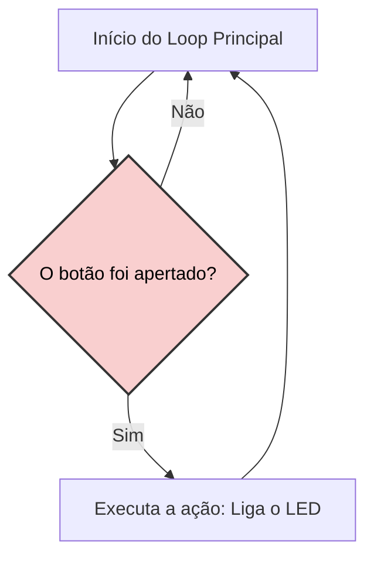
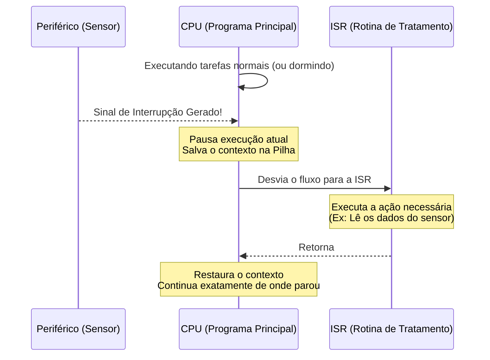
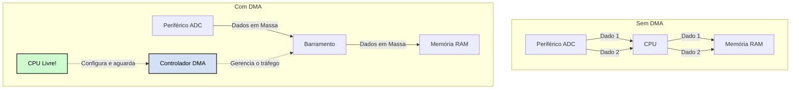
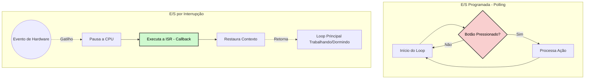
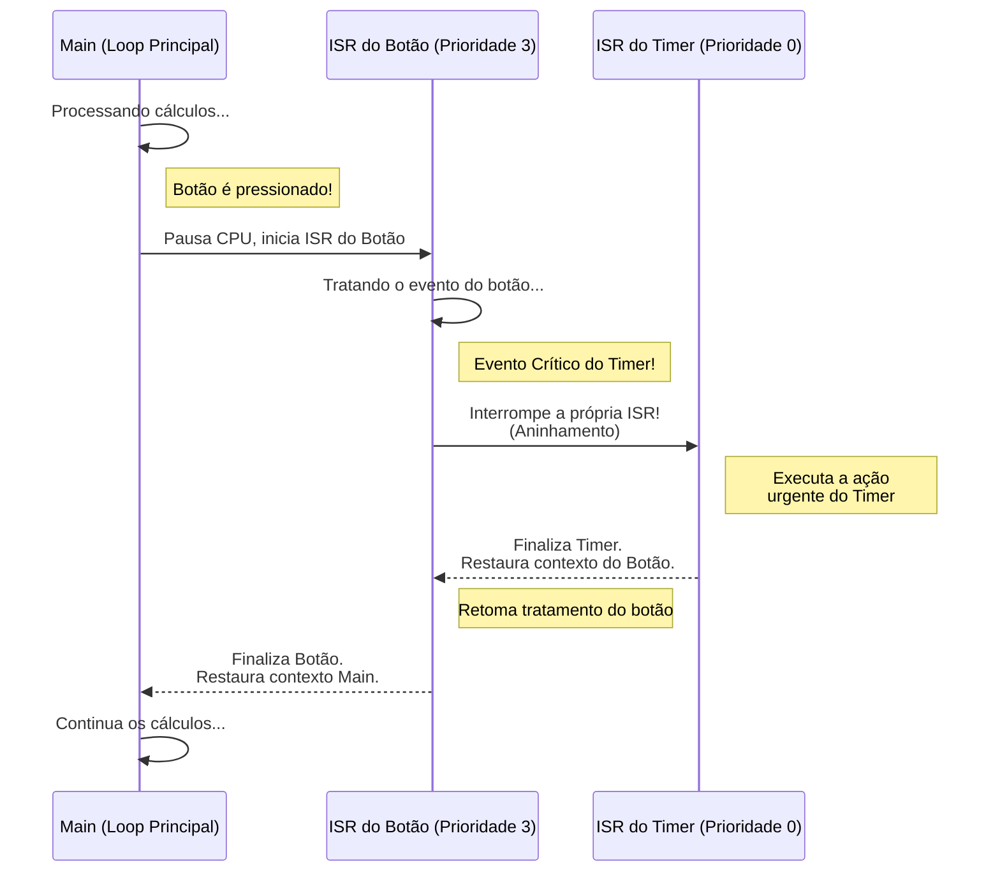
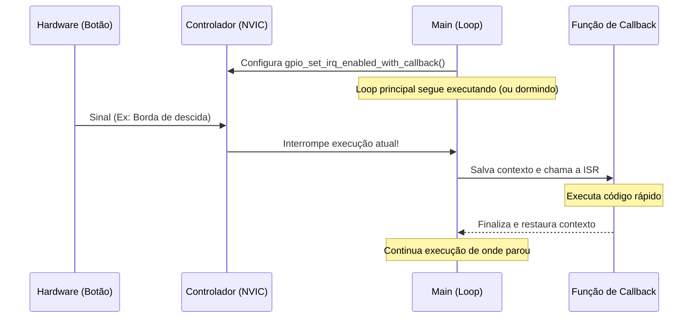
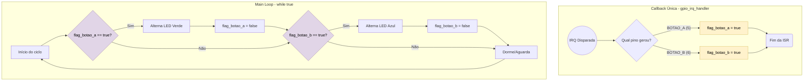

## Interrupções em Sistemas Embarcados
**Unidade 4 | Capítulo 4**

* **Tópicos:** Introdução ao mecanismo de interrupções, configuração no módulo GPIO (RP2040) e prática com BitDogLab.
---

## Objetivos

* **Compreender** o funcionamento do mecanismo de interrupções e suas vantagens.
* **Configurar** o módulo de interrupções e rotinas de tratamento de interrupções (ISRs) no RP2040.
* **Desenvolver** código prático utilizando a SDK C/C++ da Pico W no VS Code.
* **Resolver** problemas em tempo real utilizando a BitDogLab.

---

## Técnicas de Entrada e Saída (E/S)

Como o microcontrolador "lê" o mundo externo?

Para entender como um microcontrolador interage com o mundo externo, precisamos estudar três principais técnicas de Entrada e Saída (E/S). 

---

### 1. E/S Programada (Polling)
No **Polling**, o processador atua de forma ativa e síncrona. Ele toma a iniciativa de perguntar, repetidas vezes, qual é o estado atual do periférico.

* **A Analogia da Viagem de Carro:** Imagine uma viagem de carro com um burro falnte no banco de trás. A burro pergunta a cada 5 segundos: *"A gente já chegou?"*. O motorista (CPU) gasta uma quantidade enorme de energia e foco apenas para verificar a condição (chegar ao destino), impedindo que ele relaxe ou preste atenção em outras coisas.
* **Exemplo de Aplicação:** Um projeto muito simples de semáforo onde a placa só precisa acender LEDs sequencialmente e verificar se um botão de pedestre foi apertado. Como o sistema não tem mais nada para fazer, o *polling* é aceitável.
* **Vantagens:** Extremamente simples de programar (um simples `if` dentro de um `while(true)`).
* **Desvantagens:** Desperdício imenso de ciclos de processamento e consumo de energia elevado, pois a CPU nunca "descansa".


**Fluxograma de Execução (Polling):**


---

### 2. E/S Controlada por Interrupção (Interrupts)
Aqui o processador não "pergunta" mais; ele é **interrompido** pelo hardware quando algo importante acontece.

* **A Analogia do Micro-ondas:** Você coloca o prato no micro-ondas, digita 3 minutos e aperta "Ligar". Em vez de ficar olhando fixamente para o prato girando (Polling), você vai para a sala ler um livro (CPU executando outra tarefa ou "dormindo"). Quando o tempo acaba, o micro-ondas **apita** (gera uma interrupção). Você pausa sua leitura, vai até a cozinha, tira o prato (trata a interrupção) e depois volta a ler exatamente da página onde parou (restaura o contexto).
* **Exemplo de Aplicação:** Um sistema de alarme IoT (Internet das Coisas) movido a bateria. O processador passa 99% do tempo em modo *Deep Sleep*, consumindo pouquissima energia. Quando um sensor de movimento detecta presença, ele envia um sinal elétrico que "acorda" o processador via interrupção apenas para enviar um alerta Wi-Fi e voltar a dormir.
* **Vantagens:** Alta eficiência energética e capacidade de resposta quase instantânea a eventos críticos.
* **Desvantagens:** Maior complexidade no código. Exige cuidado com variáveis compartilhadas (uso de `volatile`) e problemas de concorrência.


**Diagrama de Sequência (Interrupção):**


---

### 3. Acesso Direto à Memória (DMA - Direct Memory Access)
O DMA introduz um **co-processador** de hardware dedicado exclusivamente a mover blocos de informações pela placa, tirando essa carga da CPU principal.

* **A Analogia da Transportadora:** Imagine que você é o gerente de uma fábrica (CPU) e precisa mover 10.000 caixas do armazém (Periférico) para a loja (Memória). Se você for carregar caixa por caixa, mesmo sendo rápido, vai passar o dia inteiro fazendo trabalho braçal e a fábrica vai parar. A solução? Você contrata uma transportadora (Controlador DMA). Você diz ao gerente deles: *"Leve essas 10.000 caixas para a loja e só me chame no rádio quando terminar"*. Você fica livre para assinar contratos importantes, enquanto as caixas são movidas nos bastidores.
* **Exemplo de Aplicação:** Conversão contínua de áudio. Se o microcontrolador precisa ler um microfone (ADC) a 44.100 amostras por segundo, usar interrupções para cada leitura travaria a placa. O DMA coleta todas as leituras de áudio e joga direto em um *buffer* na memória RAM. A CPU só é interrompida quando o *buffer* está cheio e pronto para ser processado (ex: para aplicar um filtro ou salvar num cartão SD).
* **Vantagens:** Desempenho extremo para grandes volumes de dados (áudio, displays de vídeo, comunicação de rede).
* **Desvantagens:** Configuração dos registradores do DMA costuma ser complexa e requer um hardware mais avançado (embora chips modernos como o RP2040, usado na Pico W, tenham excelentes controladores DMA).


**Diagrama de Arquitetura (DMA vs CPU):**


---

## Comparativo Polling vs. Interrupção

**Exemplo de Polling (Gasto de CPU):**
```c
// A CPU fica presa aqui perdendo tempo
while (true) {
    if (gpio_get(BOTAO_PIN) == 0) {
        liga_led();
    }
}
```

**Exemplo Conceitual de Interrupção (Eficiência):**
```c
// A CPU fica livre para dormir ou fazer cálculos
void campainha_tocou() {
    liga_led();
}
// Configuração feita apenas uma vez
```

**Fluxograma Comparativo:**


---

## Como Funciona o Mecanismo de Interrupção?

1. **Gatilho:** O periférico gera o sinal de interrupção de hardware.
2. **Pausa:** O processador finaliza a instrução atual e salva o **contexto de execução** (variáveis de estado) na pilha (Stack).
3. **Desvio:** O processador carrega o endereço do vetor de interrupções e chama a Rotina de Tratamento (**ISR** / Callback).
4. **Retorno:** Após tratar o evento, o processador restaura o contexto e retoma a tarefa anterior exatamente de onde parou.

---

## Interrupções no Microcontrolador RP2040

Para compreendermos o verdadeiro poder do microcontrolador RP2040 (o "cérebro" da Raspberry Pi Pico W), precisamos olhar para como ele organiza o caos quando múltiplas coisas acontecem ao mesmo tempo. A peça central desse quebra-cabeça é o **NVIC**.

Aqui está a expansão do tópico, rica em analogias, exemplos práticos e diagramas para facilitar o entendimento dos alunos.

---

## Interrupções no Microcontrolador RP2040
### O Módulo NVIC 
O **NVIC** (*Nested Vectored Interrupt Controller*) é um subsistema de hardware embutido no núcleo ARM Cortex-M0+ do RP2040. Ele funciona como uma central telefônica inteligente entre os periféricos e o processador.

* **A Analogia ** Imagine um pronto-socorro de um hospital. O processador (CPU) é o médico, que só pode atender um paciente por vez. O NVIC é o enfermeiro de triagem que fica na porta. Quando os pacientes (eventos de hardware) chegam, o enfermeiro avalia a gravidade (prioridade) de cada um e organiza a fila. O médico não precisa ir à recepção ver quem chegou; o enfermeiro simplesmente coloca o paciente mais urgente na frente dele.

O NVIC faz essa organização em nível de hardware, ou seja, de forma praticamente instantânea (em poucos ciclos de clock), sem gastar processamento da CPU para decidir quem deve ser atendido.


### Fontes de Interrupção
O RP2040 é capaz de gerenciar até **26 fontes diferentes de interrupção**. Cada tipo de periférico possui sua própria "linha direta" (IRQ - *Interrupt Request*) com o NVIC.

* **Exemplos de Fontes:**
    * **GPIO:** Um botão foi pressionado (IRQ do pino).
    * **UART / I2C / SPI:** O módulo de comunicação avisa: "Recebi um novo pacote de dados do sensor!"
    * **Timers:** "Passou exatamente 1 milissegundo desde a última vez, hora de atualizar o display!"
    * **PWM:** "Terminei um ciclo de onda."

### Níveis de Prioridade e Regras de Desempate
O RP2040 permite configurar **4 níveis de prioridade** (0 a 3). Na arquitetura ARM, geralmente, o número **menor** indica a prioridade **maior** (Nível 0 é a prioridade máxima, Nível 3 é a mínima).

* **A Analogia do Embarque no Aeroporto:** Pense nas filas de embarque de um voo.
    * *Prioridade 0 (Diamante/Emergência)*: Passa na frente de todos.
    * *Prioridade 3 (Econômica/Eventos Comuns)*: Só embarca se as outras filas estiverem vazias.
* **O Desempate (Tie-breaker):** E se dois eventos com a mesma prioridade (ex: dois passageiros da classe Econômica) chegarem no exato mesmo nanossegundo? O hardware consulta a tabela fixa de IRQs do RP2040 (que vai de 0 a 25). A interrupção com o **menor número de IRQ na tabela** ganha a corrida.

### 4. Interrupções Aninhadas
A palavra "Nested" (Aninhada) no nome do NVIC significa que **uma interrupção pode ser interrompida por outra interrupção** – desde que a nova seja mais urgente (prioridade maior).

* **A Analogia do Incêndio na Cozinha:**
   1. Você está na sala assistindo TV (Loop Principal).
   2. A campainha toca. Você pausa a TV e vai atender o entregador de pizza (Interrupção de Prioridade Baixa).
   3. Enquanto você está pagando a pizza, a panela no fogão começa a pegar fogo! (Interrupção de Prioridade Máxima).
   4. Você larga a máquina de cartão com o entregador (salva o contexto da ISR 1), corre para a cozinha, apaga o fogo (trata a ISR 2).
   5. Fogo apagado, você volta até a porta, termina de pagar a pizza (finaliza a ISR 1).
   6. Com a pizza na mão, você volta para a sala e "despausa" a TV (retorna ao Loop Principal).

**Diagrama de Sequência:**



**Por que isso é importante na prática?**
 
 Se você tiver uma função de comunicação crítica (como ler o acelerômetro de um drone para ele não cair) e uma função simples (como acender um LED quando aperta um botão), você coloca a leitura do drone com prioridade máxima. Mesmo se o usuário apertar o botão, o NVIC garante que o controle de estabilidade do drone "atravesse" o código do botão, processando a física primeiro. Isso garante que sistemas embarcados funcionem em **tempo real estrito**.

---

## Interrupções do Módulo GPIO

No Pico W, o módulo GPIO possui **apenas um vetor de interrupção** compartilhado para todos os pinos.

Pode ser acionado por quatro eventos (Máscaras da SDK):
* `GPIO_IRQ_LEVEL_LOW`: Nível baixo contínuo.
* `GPIO_IRQ_LEVEL_HIGH`: Nível alto contínuo.
* `GPIO_IRQ_EDGE_FALL`: **Borda de descida** (Focaremos neste! Ex: Botão pressionado).
* `GPIO_IRQ_EDGE_RISE`: **Borda de subida** (Ex: Botão solto).

---

## Configurando Interrupções com a SDK C/C++

Como habilitar a interrupção no seu código:

```c
// 1. Defina a função de Callback (ISR)
void gpio_irq_handler(uint gpio, uint32_t events) {
    // Código para tratar o evento
}

int main() {
    // 2. Habilite a interrupção no pino associando o callback
    gpio_set_irq_enabled_with_callback(
        BOTAO_PIN, 
        GPIO_IRQ_EDGE_FALL, 
        true, 
        &gpio_irq_handler
    );
}
```

**Diagrama de Sequência da Execução:**


---

## Boas Práticas - A Função Callback e Volatile

* **Rotinas Curtas:** A ISR deve ser **rápida**. Evite loops grandes, funções bloqueantes (`sleep_ms`) ou impressões (`printf`) dentro dela.
* **Uso de `volatile`:** O compilador C tenta otimizar o código. Se uma variável muda na ISR, use `volatile` para forçar o compilador a sempre ler o valor real da memória.

```c
// CORRETO:
volatile bool botao_pressionado = false; 

void gpio_irq_handler(uint gpio, uint32_t events) {
    botao_pressionado = true; // Rápido e sinaliza a main()
}
```

---

## Atividade 1 - Discussão

**Cenário Prático (Placa BitDogLab):**
Imagine um sistema com múltiplos sensores, LEDs e botões. 

  1. Como as interrupções otimizariam o desempenho deste sistema comparado ao *Polling*?
  2. Como isso ajudaria na redução do consumo de bateria se este sistema fosse um dispositivo IoT isolado?

<details>
  <summary>Notas</summary>

Aqui estão as notas estruturadas que resumem os principais pontos e conclusões esperadas para essa discussão:

**1. Otimização do Desempenho (Interrupções vs. Polling):**
* **Fim do desperdício de processamento:** No modelo de *Polling*, a CPU gasta milhares de ciclos de clock apenas para confirmar que "nada aconteceu". Com interrupções, a CPU só é acionada quando o hardware detecta uma mudança real.
* **Multitarefa e Liberação da CPU:** Enquanto aguarda o acionamento de um botão ou sensor, o microcontrolador fica totalmente livre para executar tarefas complexas (como enviar pacotes via Wi-Fi, processar algoritmos ou atualizar displays) sem ser interrompido desnecessariamente.
* **Menor Latência (Respostas Imediatas):** Em sistemas com múltiplos botões e sensores, um loop de *Polling* muito grande pode causar atrasos e o sistema pode não registrar um clique rápido de botão. As interrupções garantem que o processador pare o que está fazendo e atenda ao evento quase instantaneamente.


**2. Redução do Consumo de Bateria (Foco em Dispositivos IoT):**
* **Implementação de *Sleep Modes*:** A maior vantagem das interrupções para IoT é permitir que o microcontrolador entre em modos de suspensão (*Sleep* ou *Deep Sleep*). Se não há processamento a ser feito, o chip "dorme".
* **Acionamento puramente sob demanda:** O processador permanece adormecido, reduzindo o consumo de energia de miliamperes (mA) para microamperes (µA). Ele utiliza o sinal elétrico do próprio botão ou sensor como gatilho de hardware para "acordar" (instrução WFI - *Wait For Interrupt*).
* **Extensão drástica da vida útil:** Para um sensor IoT isolado (ex: um alarme de porta em uma fazenda), o uso de *Polling* drenaria a bateria em poucos dias. Utilizando interrupções atreladas a modos de baixo consumo, a mesma bateria pode durar meses ou até anos. 


Em sistemas embarcados profissionais, a regra é: se o processador não tem nada útil para calcular naquele exato milissegundo, ele deve estar dormindo e aguardando uma interrupção.
  
</details>

---
## Atividade 2 - Detectar dois botões simultaneamente

**O Problema:** Modificar um projeto padrão para detectar **dois botões simultaneamente**.
* **Botão A (GPIO 5):** Alterna o estado (Toggle) do LED Verde.
* **Botão B (GPIO 6):** Alterna o estado (Toggle) do LED Azul.

**O Desafio de Live-Coding:**
Como usamos apenas *uma* função callback para todos os pinos GPIO, como o código vai saber qual botão foi apertado? 

### Fluxograma


*Dica:* Usem os parâmetros `(uint gpio, uint32_t events)` da função callback com um `if/else`!

---

## Fechamento

* **Resumo:** Interrupções servem para lidar com eventos externos de forma eficiente e assíncrona, liberando a CPU.
* **SDK:** A configuração via `gpio_set_irq_enabled_with_callback` facilita a vida, mas exige atenção aos tipos de evento (ex: `GPIO_IRQ_EDGE_FALL`).
* **Múltiplos Pinos:** Identificar a fonte da interrupção checando a variável `gpio` na ISR é crucial.
* **Regra:** ISRs (Callbacks) devem ser **curtas, rápidas** e usar variáveis `volatile` para se comunicar com a `main()`.

---
