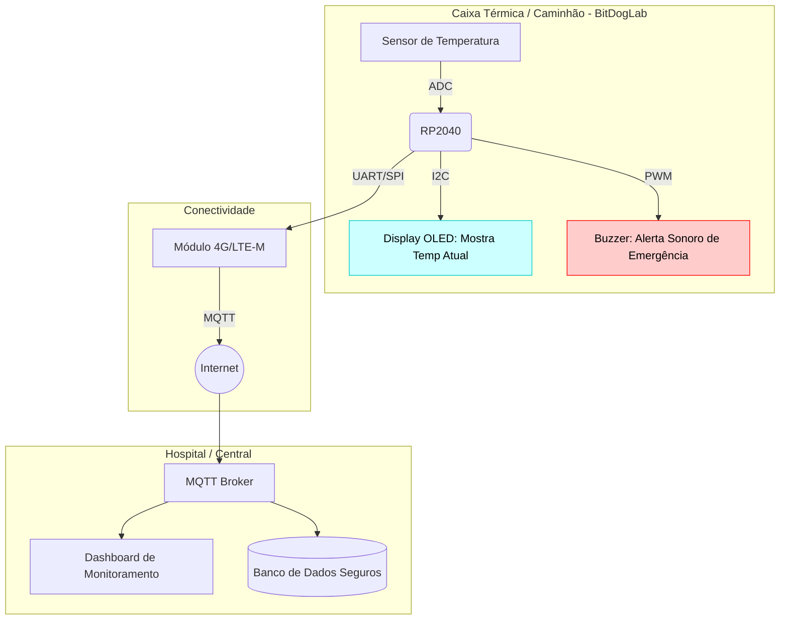
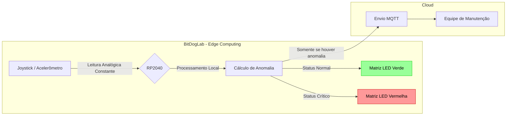
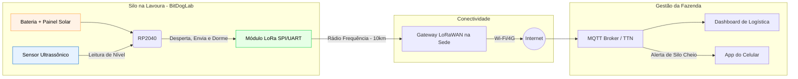
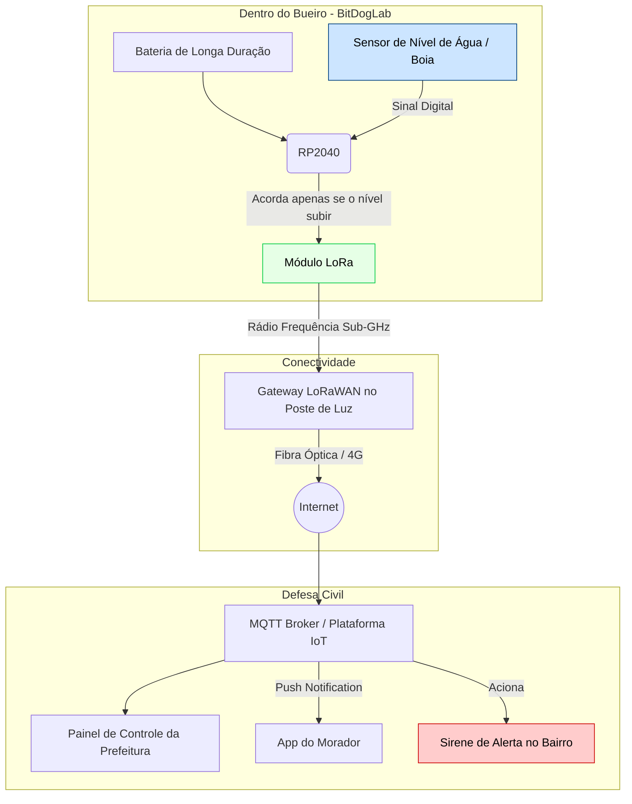

# Uso de Sistemas Embarcados
## Do Microcontrolador à Nuvem

## Objetivos de Hoje

* **Sair da Teoria:** Vocês já estudaram o ecossistema IoT (Indústria 4.0, Smart Cities, Saúde). Hoje, vamos construir as arquiteturas dessas soluções.
* **Integrar Conhecimentos:** Como o RP2040, os sensores da BitDogLab e os protocolos (MQTT, LoRa, Wi-Fi) trabalham juntos em um produto real?
* **Design de Soluções:** Tomar decisões críticas sobre o que processar na Borda (Edge) vs. Nuvem (Cloud).

## O Nosso Hardware de Borda: BitDogLab

Antes de irmos para a nuvem, tudo começa no **Edge** (Borda). O que temos na nossa placa baseada no Raspberry Pi Pico (RP2040)?

* **Cérebro:** RP2040 (Dual-core ARM Cortex-M0+)
* **Entradas (Sensores):**
  * Joystick (analógico duplo)
  * Botões A e B (digitais)
  * Microfone
  * Sensor de Temperatura interno
* **Saídas (Atuadores):**
  * Matriz de LEDs WS2812B (Neopixels)
  * Buzzer A/B (alertas sonoros)
  * Display OLED via I2C (interface local)

## Caso de Estudo 1: Cadeia de Frio (Saúde/Logística)

**O Problema:**
Vacinas perdem a eficácia se a temperatura sair da faixa de 2°C a 8°C. Como monitorar um lote dentro de um caminhão frigorífico em movimento pelo Brasil?

**O Desafio Tecnológico:**
1. Medir a temperatura continuamente.
2. Avisar o motorista na hora se algo der errado.
3. Enviar um relatório de integridade para o hospital/nuvem.

## Arquitetura: Cadeia de Frio

Se fôssemos prototipar isso com a **BitDogLab**:

## Caso de Estudo 2: Manutenção Preditiva (Indústria 4.0)

**O Problema:** Aguardar um motor industrial queimar causa paradas milionárias na linha de produção. Como prever que o equipamento vai falhar antes que o pior aconteça, sem sobrecarregar a rede da fábrica com o envio constante de dados de milhares de máquinas? 

**O Desafio Tecnológico:**
1. Medir a vibração do motor continuamente em alta frequência.
2. Processar os dados localmente na placa (Edge Computing) para não derrubar a rede Wi-Fi da fábrica.
3. Enviar um alerta preditivo para a equipe de manutenção na nuvem apenas quando uma anomalia real for detectada pela placa.

**O Conceito: Edge Computing (Computação na Borda)**
1. Não podemos enviar dados de vibração de centenas de motores a cada milissegundo pela rede Wi-Fi da fábrica. 
2. A rede cairia. .
3. A inteligência precisa estar na ponta!

## Arquitetura: Manutenção Preditiva com Edge AI

Usando o **Joystick** da BitDogLab para simular a leitura de vibração em eixos X e Y:

A Nuvem só é acionada quando o RP2040 detecta o problema localmente. Isso economiza banda e energia!

## Caso de Estudo 3: Silos Inteligentes (Agro)

**O Problema:** Fazendeiros perdem produtividade por não saberem o momento exato em que um silo de armazenamento, localizado a 10 km da sede da fazenda, está cheio ou vazio. Como monitorar o nível de grãos à distância em um local isolado, sem infraestrutura de energia elétrica ou internet Wi-Fi?

**Desafio Interativo no Chat:**
1. **Medir** o nível dos grãos constantemente sem contato físico, para evitar danos ao sensor (Qual sensor usaríamos?).
2. **Transmitir** essa leitura a longas distâncias (10 km) operando apenas com uma bateria (Qual protocolo de rede atende a esse requisito?).
3. **Integrar** as informações via MQTT em um Dashboard na nuvem para otimizar a logística dos caminhões de coleta.

## Arquitetura: Silos Inteligentes (Agro)

Como resolver o problema de medição remota a 10 km de distância usando a **BitDogLab**, garantindo que a bateria dure meses? 

Aqui, a chave é combinar um sensor sem contato com uma rede de longo alcance e baixo consumo (LPWAN), além de usar o modo de suspensão (*Deep Sleep*) do RP2040.

RP2040 não fica ligado 100% do tempo. Ele acorda a cada 1 hora, lê o sensor ultrassônico, envia o pacote via LoRa e volta a dormir. É assim que garantimos a sobrevivência do hardware no campo!)*

  
 Comparativo de Protocolos para o Caso dos Silos 

Para resolver o desafio da comunicação a 10 km de distância com alimentação a bateria, precisamos de avaliar as opções disponíveis no mercado de IoT. Qual é a melhor escolha?

| Protocolo de Comunicação | Alcance Médio | Consumo de Energia | Adequação ao Caso (Silo a 10 km) |
| :--- | :--- | :--- | :--- |
| **LoRa / LoRaWAN** | **Longo** (Até 15+ km em campo aberto) | **Muito Baixo** (Bateria dura meses/anos) |  **Ideal.** Cobre a distância necessária, não depende de operadoras na versão P2P e preserva a bateria. |
| **NB-IoT / LTE-M (Celular)**| **Muito Longo** (Cobertura nacional de rede móvel) | **Baixo / Médio** |  **Viável.** Excelente alcance, mas depende da cobertura da operadora na região e consome mais bateria que o LoRa. |
| **Sigfox** | **Longo** (Até 40 km em campo aberto) | **Muito Baixo** |  **Viável.** Ótimo alcance e consumo, mas restrito à disponibilidade da rede pública Sigfox na região agrícola. |
| **Wi-Fi (2.4 GHz)** | **Curto** (Aproximadamente 50 a 100 metros) | **Alto** |  **Inadequado.** O sinal não chega à sede (10 km) e o consumo esgotaria a bateria em poucos dias. |
| **Bluetooth (BLE)** | **Muito Curto** (Aproximadamente 10 a 50 metros) | **Muito Baixo** |  **Inadequado.** Excelente eficiência energética, mas o alcance é completamente insuficiente para o cenário. |

## Caso de Estudo 4: Prevenção de Enchentes (Atividade Coletiva)

**O Problema do Mundo Real:**
Enchentes urbanas causam prejuízos milionários e colocam vidas em risco. A prefeitura precisa saber em tempo real se os bueiros de um bairro estão entupidos ou enchendo rapidamente durante uma tempestade, para acionar a Defesa Civil e enviar alertas aos moradores antes que a rua alague.

**O Desafio Tecnológico:**
1. **Medir** o nível da água dentro de um bueiro, que é um ambiente hostil, escuro, úmido e sujeito a detritos.
2. **Transmitir** dados debaixo da terra e de tampas de ferro fundido, onde sinais como Wi-Fi ou Bluetooth não funcionam bem, utilizando apenas baterias.
3. **Integrar** um sistema de alertas em nuvem capaz de disparar notificações instantâneas para os smartphones dos cidadãos daquela rua.

## Arquitetura: Bueiro Inteligente (Smart Bairro)

Para resolver o desafio da transmissão debaixo da terra com a **BitDogLab**, a arquitetura exige um protocolo de comunicação de baixa frequência que consiga atravessar obstáculos físicos, operando com o RP2040 em *Deep Sleep* para a bateria durar anos.

Aqui o RP2040 atua como uma sentinela. Ele pode usar as portas digitais da BitDogLab para ler um sensor de boia simples. Enquanto a água não sobe, não há envio de mensagens, o que economiza bateria e não congestiona a rede pública!

---

## O que faz um Arquiteto de IoT?

* **Não é só código:** É escolher o componente certo para o ambiente certo.
* **Segurança e QoS:** Garantir que o dado chegue no prazo e sem interceptações.
* **Energia é Ouro:** Onde usar Wi-Fi vs. LoRa vs. Bluetooth? Tudo depende de onde sua bateria está.

