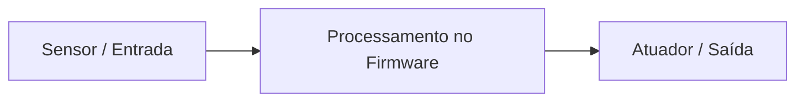
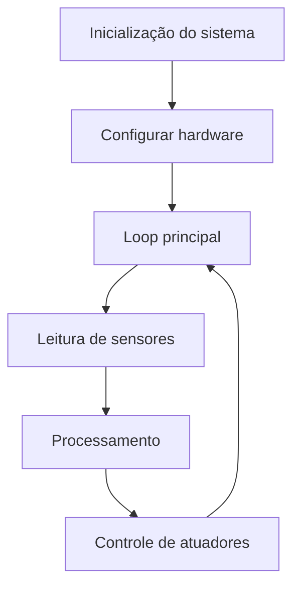
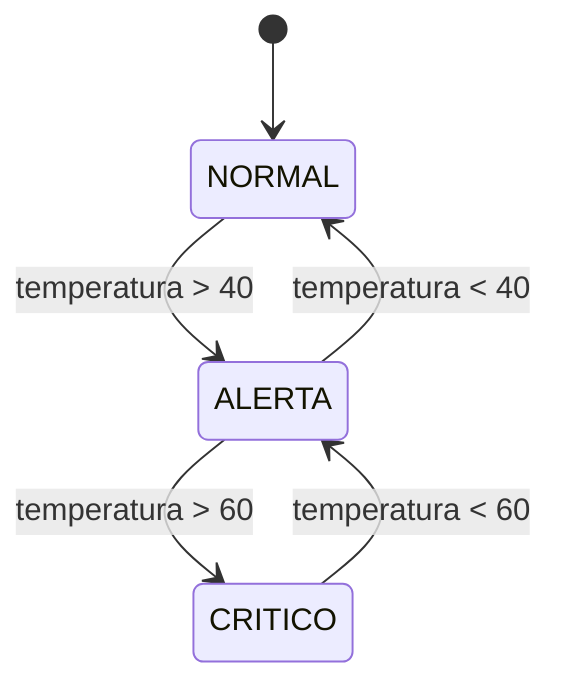
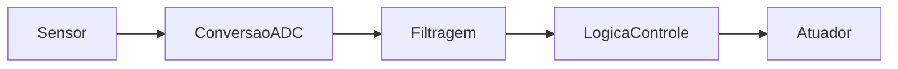
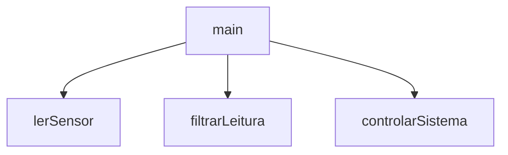
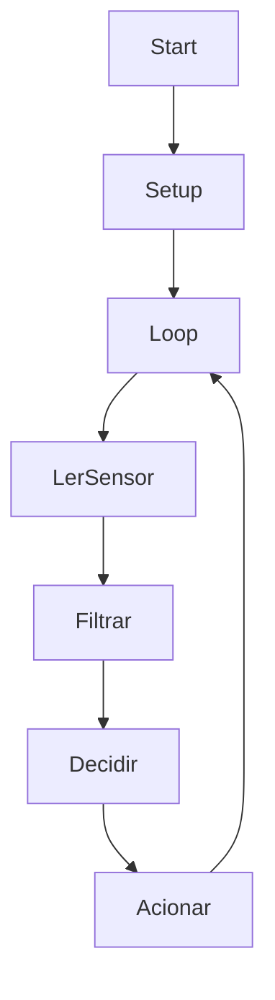

# Programação em C para Sistemas Embarcados

Mentoria prática — Arquitetura de Firmware

Objetivo da sessão:

* Conectar fundamentos de C com sistemas físicos
* Entender como firmware é estruturado
* Construir um firmware simples porém realista

Resultados esperados:

* compreender o ciclo de execução de firmware
* implementar lógica baseada em sensores
* modularizar código com funções

---

# O que muda em sistemas embarcados?

Em aplicações tradicionais:

* programa inicia
* executa tarefas
* termina

Em sistemas embarcados:

* o programa **nunca termina**
* o dispositivo opera continuamente

Exemplos:

* sensores industriais
* dispositivos IoT
* controladores automotivos
* dispositivos médicos

---

# Modelo Fundamental de Sistemas Embarcados

Todo sistema embarcado pode ser descrito por três blocos.



Entradas:

* sensores
* botões
* comunicação

Processamento:

* lógica
* filtragem
* tomada de decisão

Saídas:

* motores
* LEDs
* alarmes
* comunicação

---

# Arquitetura Geral de Firmware



Essa estrutura aparece em praticamente todo firmware.

---

# Estrutura clássica de firmware

```c
int main(){

   inicializarHardware();

   while(1){

      lerSensores();

      processarDados();

      controlarSaidas();

   }

}
```

Esse padrão aparece em:

* ESP32
* STM32
* Arduino
* Raspberry Pico

---

# Problema prático

Sistema de monitoramento de temperatura.

Regras:

| Temperatura | Estado  |
| ----------- | ------- |
| < 40°C      | NORMAL  |
| 40–60°C     | ALERTA  |
| > 60°C      | CRÍTICO |

Pergunta:

Como transformar essas regras em **lógica de firmware**?

---

# Estruturas de decisão

Ferramentas usadas:

* operadores relacionais
* operadores lógicos
* `if / else`

Exemplo:

```c
if(temp > 60){
   printf("CRITICO");
}
```

Usos típicos em firmware:

* proteção térmica
* monitoramento de bateria
* controle de velocidade

---

# Máquina de estados

Sistemas embarcados frequentemente usam **máquinas de estado**.



Benefícios:

* organização
* previsibilidade
* manutenção fácil

---

# Implementação com switch

```c
switch(estado){

case NORMAL:
   printf("Sistema normal");
break;

case ALERTA:
   printf("Sistema em alerta");
break;

case CRITICO:
   printf("Sistema crítico");
break;

}
```

Essa abordagem aparece frequentemente em:

* firmware automotivo
* robótica
* sistemas industriais

---

# Loops no firmware

Loops possuem funções específicas.

| Estrutura | Uso                           |
| --------- | ----------------------------- |
| for       | número definido de repetições |
| while     | execução contínua             |
| do while  | execução mínima garantida     |

Exemplo:

```c
while(1){
   executarSistema();
}
```

---

# Problema real de sensores

Sensores produzem **ruído**.

Exemplo:


Consequências:

* leituras instáveis
* decisões incorretas

Solução simples:

**média de múltiplas amostras**

---

# Fluxo completo de dados



Passos típicos:

1 leitura
2 filtragem
3 decisão
4 ação

---

# Exemplo de filtragem simples

```c
float lerMediaSensor(){

   float soma = 0;

   for(int i=0;i<10;i++){
      soma += lerSensor();
   }

   return soma/10;

}
```

Vantagens:

* reduz ruído
* melhora estabilidade

---

# Arquitetura modular

Firmware deve ser dividido em funções.



Cada função tem uma responsabilidade clara.

---

# Estrutura de código recomendada

```c
float lerSensor();
float filtrarLeitura(float valor);
void controlarSistema(float temperatura);
```

Benefícios:

* modularidade
* reutilização
* manutenção simples

---

# Firmware exemplo estilo ESP32

```c
#define LIMITE_ALERTA 40
#define LIMITE_CRITICO 60

float lerSensor(){
    return analogRead(34);
}

float filtrarLeitura(){

    float soma = 0;

    for(int i=0;i<10;i++){
        soma += lerSensor();
    }

    return soma/10;
}

void controlarSistema(float temp){

    if(temp > LIMITE_CRITICO){
        printf("CRITICO\n");
    }

    else if(temp > LIMITE_ALERTA){
        printf("ALERTA\n");
    }

    else{
        printf("NORMAL\n");
    }

}

void loop(){

    float temperatura;

    temperatura = filtrarLeitura();

    controlarSistema(temperatura);

}
```

---

# Fluxo do firmware ESP32



---

# Mini projeto da mentoria

Desenvolver um **controlador de incubadora**.

Entrada:

* sensor de temperatura

Processamento:

* média de leituras
* verificação de limites

Saída:

* LED
* alerta serial

---

# Requisitos do projeto

O código deve conter:

* 2 ou mais funções
* loop principal
* estrutura de decisão
* cálculo de média

Tempo sugerido:

**20 minutos**

---

# Conexão com aplicações reais

A mesma lógica aparece em:

* IoT
* automação agrícola
* robótica
* sistemas industriais
* dispositivos médicos

Ferramentas típicas:

* ESP32
* STM32
* Raspberry Pico
* Arduino

A diferença está **no hardware**, não na lógica.
