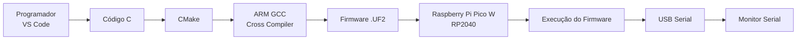
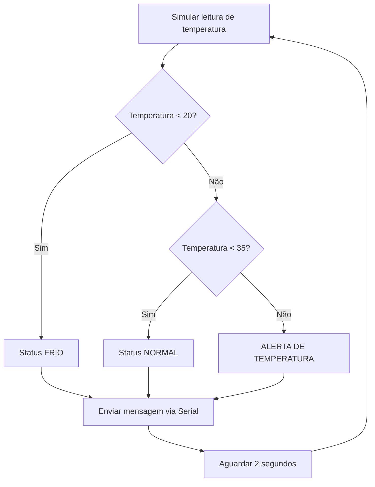
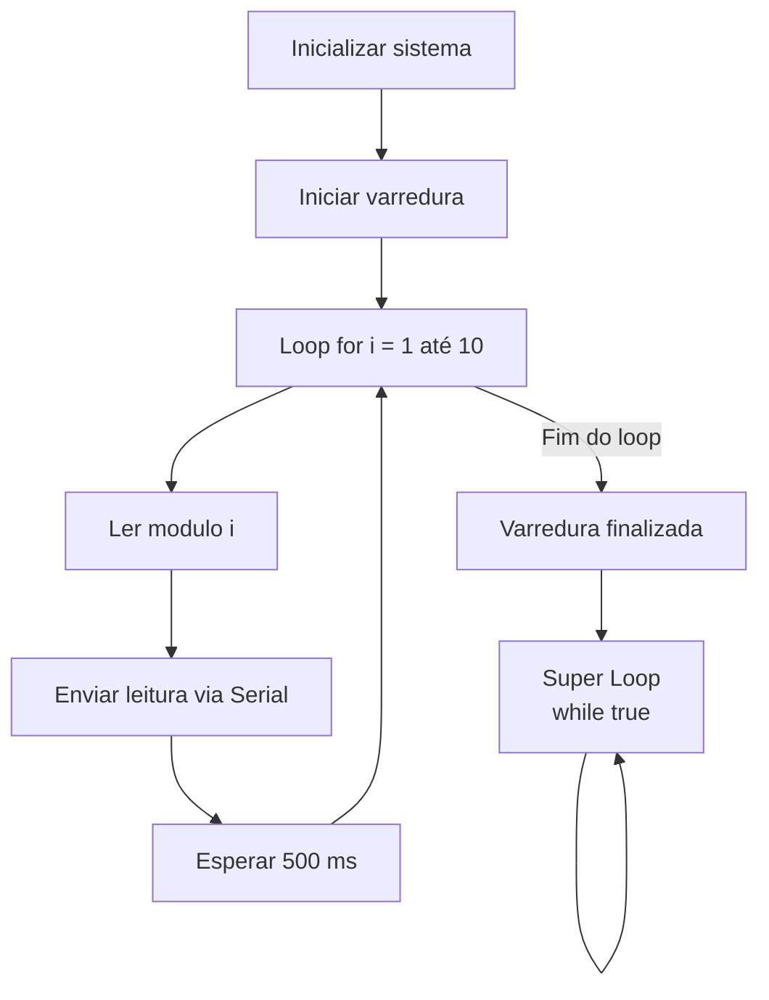
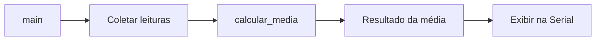
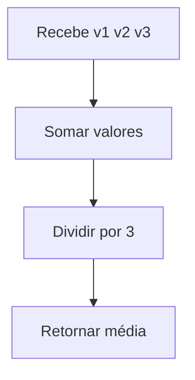
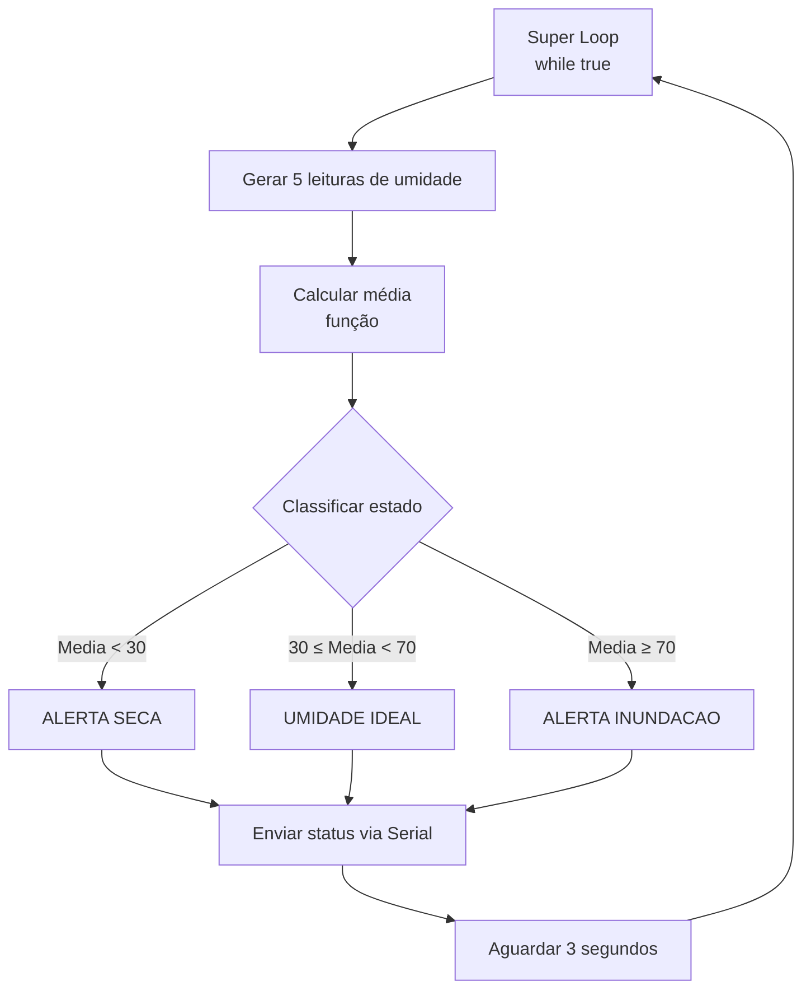

# Mentoria: Introdução a Sistemas Embarcados com C

**De Desktop para Bare-metal: Dominando o Raspberry Pi Pico W**

---

## O Novo Paradigma 

**De "Entrada/Saída" para "Sensores/Atuadores"**

* **Revisão Rápida:** Algoritmo = Entrada → Processamento → Saída.
* **No PC (Desktop):** O programa tem início e fim (`return 0`). O SO gerencia a memória. Entrada é teclado, saída é tela.
* **No Embarcado (Bare-metal):** * O algoritmo vira **Firmware**.
* O programa **nunca termina** (se terminar, o dispositivo "desligou").
* Entrada = Sensores (Simulados hoje, físicos amanhã).
* Saída = Atuadores e Porta Serial (Monitoramento).

---

## Preparando o Terreno

**O Ambiente de Desenvolvimento**

* **Nosso Hardware:** Placa BitDogLab com Raspberry Pi Pico W (ARM Cortex-M0+).
* **O Ecossistema:**
* Compilador: **ARM GCC** (cruza a compilação do PC para o Pico).
* Orquestrador: **CMake**.
* SDK: **Pico C/C++ SDK** (nossa ponte para o hardware).


* **Comunicação:** A função `stdio_init_all()` e o Monitor Serial no VS Code.



---

## Tomada de Decisão

**Condicionais (`if/else`) no Mundo Físico**

* **O Problema:** Simular um sensor de temperatura e classificar o estado térmico do sistema para proteção.
* **Hipótese:** O que acontece com o sistema se a temperatura passar de 35°C?



* **O Código (Firmware):**

```c
#include <stdio.h>
#include <stdlib.h> // Para a função rand()
#include "pico/stdlib.h"

int main() {
    stdio_init_all();

    while (true) {
        int temperatura = rand() % 50; // Simula leitura do sensor
        printf("Temperatura lida: %d C\n", temperatura);

        if (temperatura < 20) {
            printf("Status: FRIO\n\n");
        } else if (temperatura >= 20 && temperatura < 35) {
            printf("Status: NORMAL\n\n");
        } else {
            printf("Status: ALERTA DE TEMPERATURA\n\n");
        }
        sleep_ms(2000); // Tempo de amostragem
    }
}

```
---

## O Tempo e a Repetição

**Loops (`for` vs `while`) em Embarcados**

* **O Problema:** Criar um contador de ciclos para monitorar o tempo de atividade (uptime) ou ler um barramento sequencialmente.
* **O "Super Loop" (`while(true)`):** Mantém o sistema vivo.
* **O Loop Local (`for`):** Executa tarefas finitas e repetitivas.



* **O Código (Firmware):**

```c
#include <stdio.h>
#include "pico/stdlib.h"

int main() {
    stdio_init_all();
    sleep_ms(2000); // Tempo para abrir a serial

    printf("Iniciando varredura de sensores...\n");

    for(int i = 1; i <= 10; i++) {
        printf("Leitura do modulo %d executada\n", i);
        sleep_ms(500); // Polling (intervalo de leitura)
    }

    printf("Varredura finalizada. Aguardando novo ciclo...\n");
    
    while(true); // Super loop "vazio" apenas para segurar o firmware ligado
}

```
---

## Modularização

**Funções para organizar o caos**

* **O Problema:** Sistemas embarcados crescem rápido. Jogar tudo na `main()` gera um "código espaguete".
* **A Solução:** Separar lógicas em blocos reutilizáveis (drivers virtuais).



Detalhando a função:




* **O Código (Firmware):**

```c
#include <stdio.h>
#include "pico/stdlib.h"

// Função modularizada
float calcular_media(int v1, int v2, int v3) {
    return (v1 + v2 + v3) / 3.0;
}

int main() {
    stdio_init_all();
    sleep_ms(2000);

    int leitura1 = 25, leitura2 = 28, leitura3 = 30;
    
    // O main fica limpo, apenas chamando a função
    float media = calcular_media(leitura1, leitura2, leitura3);

    printf("Leituras: %d %d %d\n", leitura1, leitura2, leitura3);
    printf("Media calculada: %.2f\n", media);

    while(true);
}

```
---

## Desafio

**Missão: Sistema de Monitoramento Integrado**

Agora é com vocês! Juntem tudo o que vimos hoje em um único Firmware.

**Requisitos do Sistema:**

1. Gerar um valor de sensor de umidade aleatório (0 a 100%).
2. Criar uma **função** para calcular a média de 5 leituras consecutivas (use um **loop** para somar).
3. Usar um **condicional** para classificar:
* Média < 30: "ALERTA SECA"
* Média >= 30 e < 70: "UMIDADE IDEAL"
* Média >= 70: "ALERTA INUNDACAO"


4. O sistema deve rodar infinitamente (**Super Loop**), atualizando a cada 3 segundos.

Fluxograma



---

## Resumo

* Hoje, estudamos a lógica embarcada, o tempo de execução e o *debug* via Serial.
* **Na próxima mentoria:** Vamos trocar o `printf` e os números aleatórios por tensão elétrica de verdade! Vamos acender LEDs, ler botões físicos e usar os GPIOs da BitDogLab.
* **Lição de casa:** Explore os exemplos do SDK da Raspberry Pi e tente implementar e testar mudanças nos tempos do `sleep_ms` do desafio de hoje.
