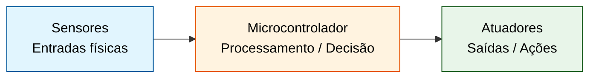
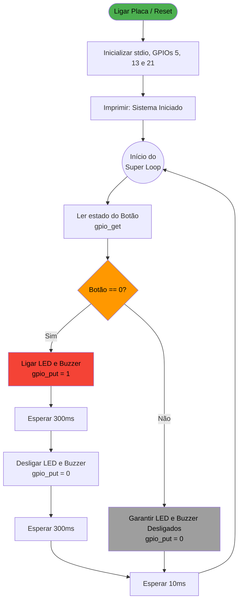

# Revisão: Introdução à Arquitetura de Microcontroladores
**Mentoria Prática - Unidade 3/4**

---

# Objetivos da Sessão de Hoje

* **Revisar:** O paradigma de programação Bare-metal vs Desktop.
* **Compreender:** A estrutura clássica de um Firmware (Setup + Super Loop).
* **Praticar:** Interagir com o mundo físico usando Botões (Entrada), LEDs e Buzzers (Saídas).
* **Aplicar:** Controlar as GPIOs 10 e 21 da placa BitDogLab utilizando a linguagem C e o Pico SDK.

---

# 1. O Novo Paradigma: Desktop vs. Bare-Metal

O que muda quando saímos do computador e vamos para o microcontrolador?

**No Computador (Desktop):**
* O programa inicia, executa suas tarefas e **termina** (`return 0`).
* O Sistema Operacional gerencia a memória, teclado, tela e rede.

**No Microcontrolador (Bare-Metal):**
* O nosso algoritmo se torna o **Firmware**.
* O programa **nunca termina**. Se o código chegar ao fim, o dispositivo "morreu" (travou).
* Nós gerenciamos diretamente o hardware (registradores, pinos lógicos, memória).

---

# 2. Modelo de um Sistema Embarcado

Todo sistema embarcado, do mais simples ao mais complexo, obedece a um fluxo contínuo de interação com o mundo real:



* **Entradas (Sensores):** Botões, termômetros, acelerômetros.
* **Saídas (Atuadores):** LEDs, Buzzers, Motores, Relés.

---

# 3. A Arquitetura Clássica de um Firmware

Para que o programa nunca termine e funcione corretamente, usamos uma estrutura universal em C:

1. **Setup (Inicialização):** Roda apenas uma vez quando a placa liga. Configura pinos, comunicação serial e variáveis iniciais.
2. **Super Loop (Loop Principal):** Roda infinitamente. Lê as entradas, toma decisões e atualiza as saídas.

---

# 4. Nosso Hardware de Hoje

Vamos utilizar a placa **BitDogLab** (baseada no RP2040 / Raspberry Pi Pico W).

**Nossos Pinos de Foco:**
* **GPIO 5:** Botão A (Entrada Digital).
* **GPIO 10:** LED RGB - Canal (Saída Digital / Atuador 1).
* **GPIO 21:** Buzzer (Saída Digital / Atuador 2).

*Objetivo:* Criar um alarme visual e sonoro que é disparado ao pressionar o botão.

---

# 5. Mão na Massa: O Código (C/Pico SDK)

Aqui está o código completo do nosso firmware de alarme:

```c
#include <stdio.h>
#include "pico/stdlib.h"

// Mapeamento de Hardware
#define BOTAO_PIN 5
#define LED_PIN 13
#define BUZZER_PIN 21

// Função para gerar som no buzzer passivo (Onda Quadrada via Software)
void emitir_bip(uint pino, uint frequencia, uint duracao_ms) {
    // Calcula o tempo de cada ciclo em microssegundos (1 segundo = 1.000.000 us)
    uint periodo_us = 1000000 / frequencia; 
    uint meio_periodo_us = periodo_us / 2;
    // Calcula quantos ciclos cabem na duração desejada
    uint ciclos = (duracao_ms * 1000) / periodo_us; 

    // Loop que faz a membrana do buzzer vibrar
    for (uint i = 0; i < ciclos; i++) {
        gpio_put(pino, 1);       // Liga o buzzer
        sleep_us(meio_periodo_us); // Espera metade do tempo
        gpio_put(pino, 0);       // Desliga o buzzer
        sleep_us(meio_periodo_us); // Espera a outra metade
    }
}

int main() {
    // 1. SETUP: Inicialização
    stdio_init_all(); 

    gpio_init(LED_PIN);
    gpio_set_dir(LED_PIN, GPIO_OUT);
    gpio_put(LED_PIN, 0);

    gpio_init(BUZZER_PIN);
    gpio_set_dir(BUZZER_PIN, GPIO_OUT);
    gpio_put(BUZZER_PIN, 0);

    gpio_init(BOTAO_PIN);
    gpio_set_dir(BOTAO_PIN, GPIO_IN);
    gpio_pull_up(BOTAO_PIN); // Pull-up interno ativado

    printf("Sistema de Alarme Iniciado!\n");

    // 2. SUPER LOOP
    while (true) {
        // Verifica se o botão foi pressionado
        if (gpio_get(BOTAO_PIN) == 0) {
            printf("Alarme Disparado!\n");
            
            // Liga o LED de Alerta
            gpio_put(LED_PIN, 1);
            
            // Chama a função para tocar o buzzer a 1000Hz (1kHz) por 300 milissegundos
            emitir_bip(BUZZER_PIN, 1000, 300);
            
            // Desliga o LED após o som terminar
            gpio_put(LED_PIN, 0);
            
            sleep_ms(300); // Pausa antes de repetir se o botão continuar pressionado
        } else {
            // Em repouso, o LED fica apagado 
            // (O buzzer já fica mudo naturalmente quando a função emitir_bip termina)
            gpio_put(LED_PIN, 0);
        }
        
        sleep_ms(10); // Estabilidade do sistema
    }
}
```

---

# 6. Entendendo o Fluxo do Programa

Para visualizar o que o microcontrolador está fazendo passo a passo, observe o fluxograma abaixo:



---

# 7. Pontos Críticos de Atenção

Ao desenvolver em C para o Pico, lembre-se:

1. **`gpio_init()` vs `gpio_set_dir()`**: A primeira avisa ao chip que o pino será usado como GPIO. A segunda define se a energia vai **sair** (OUT = Atuador) ou se o chip vai **escutar** (IN = Sensor).
2. **Pull-Up (`gpio_pull_up`)**: Como o botão apenas fecha o circuito com o Terra (GND), o resistor de pull-up garante que o pino leia "1" (Alta) quando não estiver pressionado, e "0" (Baixa) quando pressionado. É por isso que testamos `== 0`.
3. **`sleep_ms()`**: Nunca deixe um loop rodar na velocidade máxima do processador sem necessidade, pois isso dificulta a leitura do botão (efeito *bouncing*).

---

# 8. Discussão e Desafio Rápido

**Vamos pensar juntos!**

Como vocês alterariam o código que acabamos de ver para criar um **Controle de Incubadora** ou um **Sinal de Trânsito**?

* *Pista 1:* E se em vez de um botão, estivéssemos lendo um sensor de temperatura?
* *Pista 2:* Como faríamos para o Buzzer tocar com uma frequência diferente dependendo de quão rápido o botão é pressionado?

---

# 9. Fechamento e Dúvidas

**Resumo:**
* Programação embarcada exige pensar em ciclos infinitos.
* Configurar entradas e saídas é o coração do sistema.
* Controlamos o hardware via código usando o SDK da Raspberry Pi.

**Espaço aberto:**
Dúvidas sobre o código, instalação das ferramentas ou compilação do `.UF2`? 

*Obrigado pela presença, nos vemos na próxima mentoria!*
