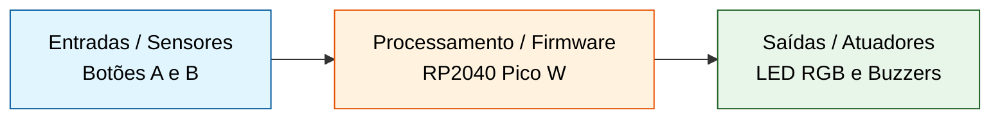
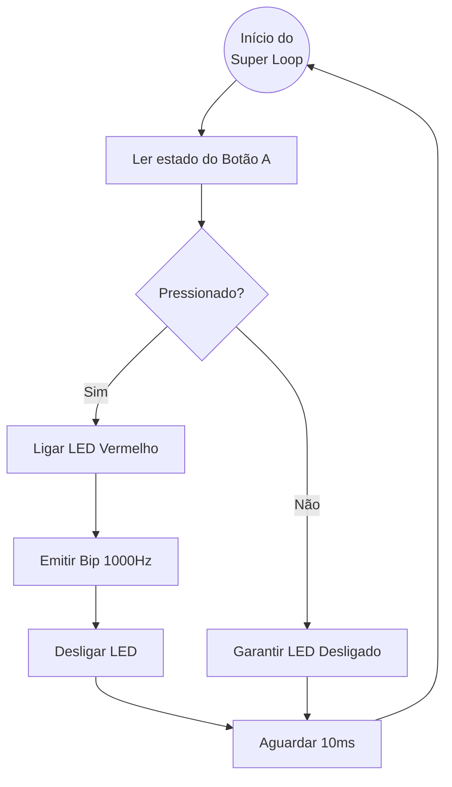

## Módulo de Entrada e Saída: GPIOs, Buzzers e Varredura

* **Tema:** Controle de atuadores e leitura de sensores na prática.
* **Plataforma Alvo:** BitDogLab (Raspberry Pi Pico W / RP2040).
* **Ferramentas:** VS Code, Pico C/C++ SDK, CMake.

---

## O Mundo Físico: Desktop vs. Embarcado

* **No PC (Desktop):** O programa tem um início e um fim claros; o Sistema Operacional gerencia todos os recursos.
* **No Embarcado (Bare-metal):** O programa nunca termina. Se o código chegar ao fim, o dispositivo travou.
* **Foco:** O sistema opera continuamente, interagindo em tempo real com o mundo físico.

---

## O Fluxo Contínuo de um Sistema Embarcado



> **Pergunta:** *"Se o nosso programa nunca pode terminar, qual estrutura da linguagem C nós obrigatoriamente precisamos usar na função `main()`?"*

---

## Conceitos: Leitura de Botão e LED RGB

* **Mapeamento:** Utilizaremos o Botão A (GPIO 5) e o canal Vermelho do LED RGB (GPIO 11).
* **`gpio_set_dir()`:** Define se a energia sai do pino (OUT = Atuador) ou se o pino apenas "escuta" (IN = Sensor).
* **`gpio_pull_up()`:** Mantém o pino em estado lógico "1" (Alta) quando o botão não está pressionado, evitando flutuações.

---

## Código: Leitura de Botão + LED RGB

```c
#include <stdio.h>
#include "pico/stdlib.h"

#define BOTAO_A 5 // Botão A na GPIO 5
#define LED_R 11  // Canal Vermelho do LED RGB na GPIO 11

int main() {
    stdio_init_all();

    gpio_init(LED_R);
    gpio_set_dir(LED_R, GPIO_OUT);
    gpio_put(LED_R, 0);

    gpio_init(BOTAO_A);
    gpio_set_dir(BOTAO_A, GPIO_IN);
    gpio_pull_up(BOTAO_A); 

    while (true) {
        if (gpio_get(BOTAO_A) == 0) { 
            gpio_put(LED_R, 1);
        } else {
            gpio_put(LED_R, 0);
        }
        sleep_ms(10);
    }
}
```

---

## Conceitos: Controle de Atuadores Sonoros (Buzzer)

* **Hardware BitDogLab:** Possui o Buzzer A na GPIO 21 e o Buzzer B na GPIO 10.
* **Onda Quadrada:** O buzzer precisa de pulsos rápidos de liga/desliga para vibrar a membrana e gerar som.
* **Modularidade:** Reutilizaremos a função `emitir_bip` baseada em delays de microssegundos (`sleep_us()`).

---

## Código: Controle do Buzzer

```c
#include <stdio.h>
#include "pico/stdlib.h"

#define BUZZER_A 21

void emitir_bip(uint pino, uint frequencia, uint duracao_ms) {
    uint periodo_us = 1000000 / frequencia; 
    uint meio_periodo_us = periodo_us / 2;
    uint ciclos = (duracao_ms * 1000) / periodo_us; 

    for (uint i = 0; i < ciclos; i++) {
        gpio_put(pino, 1);       
        sleep_us(meio_periodo_us); 
        gpio_put(pino, 0);       
        sleep_us(meio_periodo_us); 
    }
}

int main() {
    stdio_init_all();
    
    gpio_init(BUZZER_A);
    gpio_set_dir(BUZZER_A, GPIO_OUT);

    while (true) {
        printf("Emitindo som de alerta...\n");
        emitir_bip(BUZZER_A, 1000, 500);
        sleep_ms(2000);
    }
}
```

---

## Lógica Integrada: Botão + LED + Buzzer



---

## Código: Combinação (Botão, LED e Buzzer)

```c
#include <stdio.h>
#include "pico/stdlib.h"

#define BOTAO_A 5
#define LED_R 11
#define BUZZER_A 21

void emitir_bip(uint pino, uint frequencia, uint duracao_ms) {
    uint periodo_us = 1000000 / frequencia; 
    uint meio_periodo_us = periodo_us / 2;
    uint ciclos = (duracao_ms * 1000) / periodo_us; 
    for (uint i = 0; i < ciclos; i++) {
        gpio_put(pino, 1);       
        sleep_us(meio_periodo_us); 
        gpio_put(pino, 0);       
        sleep_us(meio_periodo_us); 
    }
}

int main() {
    stdio_init_all();
    gpio_init(BOTAO_A); gpio_set_dir(BOTAO_A, GPIO_IN); gpio_pull_up(BOTAO_A);
    gpio_init(LED_R); gpio_set_dir(LED_R, GPIO_OUT);
    gpio_init(BUZZER_A); gpio_set_dir(BUZZER_A, GPIO_OUT);

    while (true) {
        if (gpio_get(BOTAO_A) == 0) { 
            gpio_put(LED_R, 1); 
            emitir_bip(BUZZER_A, 1000, 200);
            gpio_put(LED_R, 0); 
            sleep_ms(300);
        }
        sleep_ms(10);
    }
}
```

---

## Conceito: Teclado Matricial e Varredura


* **Otimização de Hardware:** Teclados 4x4 usam 8 pinos (4 linhas + 4 colunas) em vez de 16 pinos individuais.
* **Como funciona (Varredura):** O microcontrolador energiza uma linha por vez e lê as colunas para encontrar o cruzamento.
* **Nossa Simulação:** O Botão A (GPIO 5) simulará a Coluna 1, e o Botão B (GPIO 6) simulará a Coluna 2.

> **Pergunta:** *"Por que um teclado matricial 4x4 economiza pinos do microcontrolador em comparação a ligar cada botão individualmente?"*

---

## Código: Simulação de Teclado Matricial

```c
#include <stdio.h>
#include "pico/stdlib.h"

#define BOTAO_A 5
#define BOTAO_B 6

char varredura_teclado_simulado() {
    if (gpio_get(BOTAO_A) == 0) return 'A';
    if (gpio_get(BOTAO_B) == 0) return 'B';
    return '0';
}

int main() {
    stdio_init_all();
    gpio_init(BOTAO_A); gpio_set_dir(BOTAO_A, GPIO_IN); gpio_pull_up(BOTAO_A);
    gpio_init(BOTAO_B); gpio_set_dir(BOTAO_B, GPIO_IN); gpio_pull_up(BOTAO_B);

    while (true) {
        char tecla = varredura_teclado_simulado();
        if (tecla != '0') {
            printf("Tecla pressionada na matriz simulada: %c\n", tecla);
            sleep_ms(300);
        }
        sleep_ms(10);
    }
}
```

---

## Mini-Projeto Prático: Painel de Segurança

* **Missão:** Criar um sistema responsivo de alertas usando dois botões independentes.
* **Botão A (Pânico Silencioso):** O LED RGB Vermelho deve piscar rapidamente 3 vezes.
* **Botão B (Alarme Geral):** O Buzzer A toca por 1 segundo e o LED RGB Verde acende.
* **Restrição Obrigatória:** Crie pelo menos uma função própria para organizar a lógica visual principal.
* **Critério de Sucesso:** Código compila via CMake e roda infinitamente no super loop sem travar.

---

## Encerramento e Desafios para Casa

* **Revisão da Aula:** A importância de separar a inicialização (setup) do ciclo de execução (super loop) e o papel do `gpio_get`.
* **Desafio 1 (Sirene):** Modificar a função `emitir_bip` para alternar entre 800Hz e 1200Hz, criando um efeito de sirene real.
* **Desafio 2 (Botão de Reset):** Mapear o clique do Joystick (chave digital) como um terceiro botão para resetar e desligar o alarme. 

<details>
  <summary> Gabaritos para os desafios</summary>

  # Painel de segurança

  ````C
#include <stdio.h>
#include "pico/stdlib.h"

// Mapeamento de Pinos (Ajuste o LED_G conforme a pinagem exata do seu LED RGB)
#define BOTAO_A 5
#define BOTAO_B 6
#define LED_R 11
#define LED_G 12 
#define BUZZER_A 21

// -----------------------------------------------------------
// Função base fornecida aos alunos na aula
// -----------------------------------------------------------
void emitir_bip(uint pino, uint frequencia, uint duracao_ms) {
    uint periodo_us = 1000000 / frequencia; 
    uint meio_periodo_us = periodo_us / 2;
    uint ciclos = (duracao_ms * 1000) / periodo_us; 

    for (uint i = 0; i < ciclos; i++) {
        gpio_put(pino, 1);       
        sleep_us(meio_periodo_us); 
        gpio_put(pino, 0);       
        sleep_us(meio_periodo_us); 
    }
}

// -----------------------------------------------------------
// Funções próprias exigidas pela restrição do mini-projeto
// -----------------------------------------------------------

// Lógica Visual do Botão A
void piscar_panico_silencioso() {
    for (int i = 0; i < 3; i++) {
        gpio_put(LED_R, 1);
        sleep_ms(100); // Pisca rápido
        gpio_put(LED_R, 0);
        sleep_ms(100);
    }
}

// Lógica Visual/Sonora do Botão B
void disparar_alarme_geral() {
    gpio_put(LED_G, 1); // Acende o LED Verde
    emitir_bip(BUZZER_A, 1000, 1000); // Toca o buzzer por 1000ms (1 segundo)
    gpio_put(LED_G, 0); // Apaga o LED Verde ao terminar o som
}

// -----------------------------------------------------------
// Função Principal
// -----------------------------------------------------------
int main() {
    stdio_init_all();

    // 1. Setup dos Botões (Sensores - IN com Pull-Up)
    gpio_init(BOTAO_A); 
    gpio_set_dir(BOTAO_A, GPIO_IN); 
    gpio_pull_up(BOTAO_A);

    gpio_init(BOTAO_B); 
    gpio_set_dir(BOTAO_B, GPIO_IN); 
    gpio_pull_up(BOTAO_B);

    // 2. Setup dos LEDs e Buzzer (Atuadores - OUT)
    gpio_init(LED_R); gpio_set_dir(LED_R, GPIO_OUT); gpio_put(LED_R, 0);
    gpio_init(LED_G); gpio_set_dir(LED_G, GPIO_OUT); gpio_put(LED_G, 0);
    gpio_init(BUZZER_A); gpio_set_dir(BUZZER_A, GPIO_OUT);

    printf("Painel de Seguranca Iniciado. Aguardando comandos...\n");

    // 3. Super Loop
    while (true) {
        
        // Verifica o Botão A (Pânico Silencioso)
        if (gpio_get(BOTAO_A) == 0) {
            printf("Alerta: Panico Silencioso Acionado!\n");
            piscar_panico_silencioso();
            sleep_ms(300); // Tempo de debounce para evitar reentradas acidentais
        }

        // Verifica o Botão B (Alarme Geral)
        if (gpio_get(BOTAO_B) == 0) {
            printf("Alerta: Alarme Geral Acionado!\n");
            disparar_alarme_geral();
            sleep_ms(300); // Tempo de debounce
        }

        sleep_ms(10); // Estabilidade do processador e economia de energia
    }
    
    return 0; // O código nunca deve chegar aqui no bare-metal
}
  ````

  # Desafio 1

  ````C
#include <stdio.h>
#include "pico/stdlib.h"

#define BUZZER_A 21

// -----------------------------------------------------------
// Função base (Onda Quadrada)
// -----------------------------------------------------------
void emitir_bip(uint pino, uint frequencia, uint duracao_ms) {
    uint periodo_us = 1000000 / frequencia; 
    uint meio_periodo_us = periodo_us / 2;
    uint ciclos = (duracao_ms * 1000) / periodo_us; 

    for (uint i = 0; i < ciclos; i++) {
        gpio_put(pino, 1);       
        sleep_us(meio_periodo_us); 
        gpio_put(pino, 0);       
        sleep_us(meio_periodo_us); 
    }
}

// -----------------------------------------------------------
// Solução do Desafio 1: Função de Sirene
// -----------------------------------------------------------
void tocar_sirene(uint pino, uint duracao_total_ms) {
    uint tempo_decorrido = 0;
    uint tempo_por_tom = 400; // Cada frequência toca durante 400ms

    // O ciclo continua até atingir o tempo total desejado para a sirene
    while (tempo_decorrido < duracao_total_ms) {
        
        // Emite o tom mais grave (800Hz)
        emitir_bip(pino, 800, tempo_por_tom);
        tempo_decorrido += tempo_por_tom;

        // Previne que o tom agudo toque se o tempo total já tiver sido ultrapassado
        if (tempo_decorrido >= duracao_total_ms) {
            break; 
        }

        // Emite o tom mais agudo (1200Hz)
        emitir_bip(pino, 1200, tempo_por_tom);
        tempo_decorrido += tempo_por_tom;
    }
}

// -----------------------------------------------------------
// Função Principal
// -----------------------------------------------------------
int main() {
    stdio_init_all();
    
    // Configuração do Buzzer
    gpio_init(BUZZER_A);
    gpio_set_dir(BUZZER_A, GPIO_OUT);

    printf("Sistema Iniciado.\n");

    while (true) {
        printf("A disparar Sirene de Alarme!\n");
        
        // Toca a sirene durante 4000ms (4 segundos)
        tocar_sirene(BUZZER_A, 4000);
        
        printf("Pausa...\n");
        sleep_ms(3000); // Aguarda 3 segundos antes de repetir no super loop
    }
    
    return 0;
}
  ````
 

  # Desafio 2

  ````C
#include <stdio.h>
#include <stdbool.h> // Necessário para usar o tipo bool (true/false)
#include "pico/stdlib.h"

#define BOTAO_A 5
#define BOTAO_B 6
#define BOTAO_JOYSTICK 22 // Pino do clique do Joystick (Ajustar se necessário)
#define LED_R 11
#define LED_G 12 
#define BUZZER_A 21

// -----------------------------------------------------------
// Função base (Onda Quadrada)
// -----------------------------------------------------------
void emitir_bip(uint pino, uint frequencia, uint duracao_ms) {
    uint periodo_us = 1000000 / frequencia; 
    uint meio_periodo_us = periodo_us / 2;
    uint ciclos = (duracao_ms * 1000) / periodo_us; 

    for (uint i = 0; i < ciclos; i++) {
        gpio_put(pino, 1);       
        sleep_us(meio_periodo_us); 
        gpio_put(pino, 0);       
        sleep_us(meio_periodo_us); 
    }
}

// Lógica Visual do Botão A (Pânico)
void piscar_panico_silencioso() {
    for (int i = 0; i < 3; i++) {
        gpio_put(LED_R, 1);
        sleep_ms(100);
        gpio_put(LED_R, 0);
        sleep_ms(100);
    }
}

// -----------------------------------------------------------
// Função Principal
// -----------------------------------------------------------
int main() {
    stdio_init_all();

    // 1. Configuração das Entradas (Sensores)
    gpio_init(BOTAO_A); gpio_set_dir(BOTAO_A, GPIO_IN); gpio_pull_up(BOTAO_A);
    gpio_init(BOTAO_B); gpio_set_dir(BOTAO_B, GPIO_IN); gpio_pull_up(BOTAO_B);
    
    // Configuração do clique do Joystick como botão de reset
    gpio_init(BOTAO_JOYSTICK); 
    gpio_set_dir(BOTAO_JOYSTICK, GPIO_IN); 
    gpio_pull_up(BOTAO_JOYSTICK);

    // 2. Configuração das Saídas (Atuadores)
    gpio_init(LED_R); gpio_set_dir(LED_R, GPIO_OUT); gpio_put(LED_R, 0);
    gpio_init(LED_G); gpio_set_dir(LED_G, GPIO_OUT); gpio_put(LED_G, 0);
    gpio_init(BUZZER_A); gpio_set_dir(BUZZER_A, GPIO_OUT);

    // Variável de Estado: Memoriza se o alarme está a tocar ou não
    bool alarme_ativo = false;

    printf("Sistema Iniciado. Pressione B para Alarme e Joystick para Reset.\n");

    // 3. Super Loop
    while (true) {
        
        // --- VERIFICAÇÃO DE ENTRADAS ---
        
        // Pânico Silencioso (independente do estado do alarme geral)
        if (gpio_get(BOTAO_A) == 0) {
            piscar_panico_silencioso();
        }

        // Liga o Alarme (Muda o estado para VERDADEIRO)
        if (gpio_get(BOTAO_B) == 0) {
            if (!alarme_ativo) {
                printf("Alarme ATIVADO!\n");
                alarme_ativo = true;
            }
            sleep_ms(200); // Debounce
        }

        // Desliga/Faz o Reset ao Alarme (Muda o estado para FALSO)
        if (gpio_get(BOTAO_JOYSTICK) == 0) {
            if (alarme_ativo) {
                printf("Alarme DESATIVADO pelo utilizador.\n");
                alarme_ativo = false;
                gpio_put(LED_G, 0); // Garante que o LED se apaga ao fazer reset
            }
            sleep_ms(200); // Debounce
        }

        // --- EXECUÇÃO DO ESTADO (AÇÕES CONTÍNUAS) ---
        
        // Se o alarme estiver ativo, fica a tocar e a piscar continuamente
        if (alarme_ativo) {
            gpio_put(LED_G, 1);
            emitir_bip(BUZZER_A, 1000, 200); // Som intermitente
            gpio_put(LED_G, 0);
            sleep_ms(200); // Pausa entre os bips do alarme
        }

        sleep_ms(10); // Estabilidade do processador
    }
    
    return 0;
}
  ````

  
</details>
