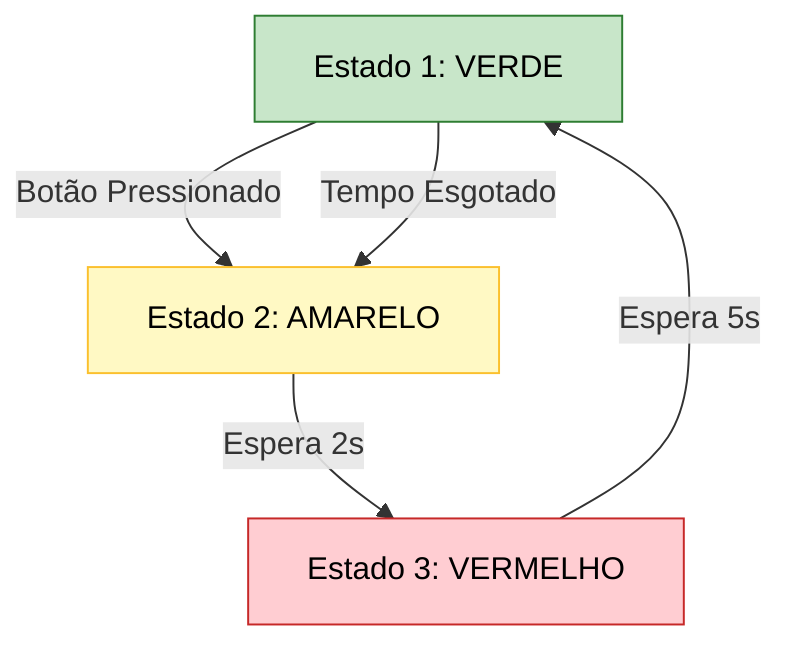
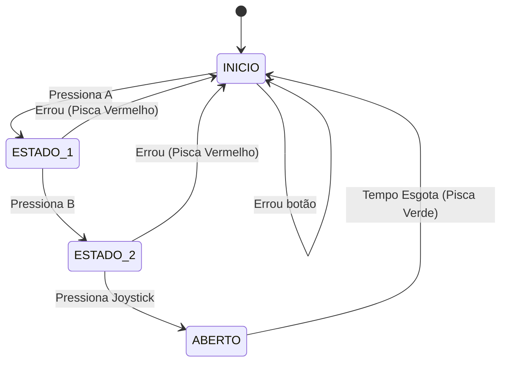

## Máquinas de Estado e Logica Sequêncial

* **O Problema:** Até agora, nossos sistemas reagiam imediatamente (Botão pressionado = LED aceso). Mas e se a ação depender do que aconteceu *antes*? (Ex: um cofre só abre se a senha correta foi digitada passo a passo).
* **A Solução:** Máquinas de Estado Finito (FSM). O sistema tem "estados" (modo) e transita entre eles dependendo dos eventos (botões) e do tempo.
* **Exemplos clássicos:** Semáforos, catracas de metrô, alarmes e cofres digitais.

> 💬 **Pergunta:** *"Num semáforo de trânsito comum, qual é o estado que obrigatoriamente vem depois do Verde, antes de ir para o Vermelho?"* (Resposta esperada: Amarelo. Isso ilustra que a ordem dos estados importa).

---
# O Problema: Reação Imediata vs. Memória

* Até agora, nossos botões tinham reações imediatas (apertou = ligou).
* **O Desafio:** E se a ação depender do que aconteceu *antes*? (Ex: um cofre só abre se a senha correta foi digitada na ordem certa).
* **A Solução:** Máquinas de Estado Finito (FSM). O microcontrolador guarda em qual "estado" (ou modo) ele está e muda de acordo com os eventos.

> 💬 **Pergunta:** *"Num semáforo de trânsito comum, qual é o estado que obrigatoriamente vem depois do Verde, antes de ir para o Vermelho?"*

---

## Conceito: Semáforo com LED RGB

* Vamos simular um semáforo de trânsito usando o LED RGB da placa e o Botão A como "botão de pedestre".
* **Mistura de Cores (RGB):** Como não temos um LED amarelo nativo, vamos acender o **Vermelho e o Verde simultaneamente** para criar a cor Amarela.
* **A Regra:** O semáforo fica Verde. Se o botão for pressionado, ele muda para Amarelo, espera um pouco, e vai para Vermelho.

---

## Fluxograma do Semáforo (Máquina de Estados)



---

## Código: Semáforo com Botão e Cor Amarela

```c
#include <stdio.h>
#include "pico/stdlib.h"

#define BOTAO_A 5
#define LED_R 11
#define LED_G 12

// Função para facilitar o controle das cores do RGB
void set_semaforo(int r, int g) {
    gpio_put(LED_R, r);
    gpio_put(LED_G, g);
}

int main() {
    stdio_init_all();

    gpio_init(BOTAO_A); 
    gpio_set_dir(BOTAO_A, GPIO_IN); 
    gpio_pull_up(BOTAO_A);

    gpio_init(LED_R); 
    gpio_set_dir(LED_R, GPIO_OUT);

    gpio_init(LED_G); 
    gpio_set_dir(LED_G, GPIO_OUT);

    while (true) {
        set_semaforo(0, 1); // ESTADO VERDE
        
        // Loop de espera: fica verde por até 5s, checando o botão a cada 50ms
        for (int i = 0; i < 100; i++) {
            if (gpio_get(BOTAO_A) == 0) break; // Sai do loop imediatamente
            sleep_ms(50);
        }

        set_semaforo(1, 1); // ESTADO AMARELO (Mistura de Vermelho + Verde)
        sleep_ms(2000); 

        set_semaforo(1, 0); // ESTADO VERMELHO (Pedestre passa)
        sleep_ms(5000); 
    }
}
```

---

## Conceito: Cofre Digital e Displays

* **A Teoria:** Para exibir números de um cofre, usaríamos um Display de 7 Segmentos. Para 4 dígitos, usaríamos a técnica de *Multiplexação* (piscar um dígito de cada vez muito rápido) para economizar pinos do chip.
* **A Nossa Prática:** Hoje vamos focar na **lógica cerebral** do cofre. Usaremos os 3 botões da placa para criar uma senha sequencial.
* **A Senha:** Botão A ➔ Botão B ➔ Joystick.

---

## Fluxograma da Senha do Cofre



---

## Código: Cofre Digital (Parte 1 - Setup e Leitura)

```c
#include <stdio.h>
#include "pico/stdlib.h"

#define BOTAO_A 5
#define BOTAO_B 6
#define BOTAO_JOY 22
#define LED_R 11
#define LED_G 12

// Retorna qual botão foi apertado (0 = nenhum, 1=A, 2=B, 3=Joy)
int ler_botoes() {
    if (gpio_get(BOTAO_A) == 0) return 1;
    if (gpio_get(BOTAO_B) == 0) return 2;
    if (gpio_get(BOTAO_JOY) == 0) return 3;
    return 0;
}

void erro_senha() {
    printf("Erro! Senha reiniciada.\n");
    gpio_put(LED_R, 1); sleep_ms(500); gpio_put(LED_R, 0);
}
```

---

## Código: Cofre Digital (Parte 2 - Máquina de Estado)

```c
int main() {

    gpio_init(BOTAO_A); 
    gpio_set_dir(BOTAO_A, GPIO_IN); 
    gpio_pull_up(BOTAO_A);

    gpio_init(BOTAO_B); 
    gpio_set_dir(BOTAO_B, GPIO_IN); 
    gpio_pull_up(BOTAO_B);

    gpio_init(BOTAO_JOY); 
    gpio_set_dir(BOTAO_JOY, GPIO_IN); 
    gpio_pull_up(BOTAO_JOY);

    gpio_init(LED_R); 
    gpio_set_dir(LED_R, GPIO_OUT);

    gpio_init(LED_G); 
    gpio_set_dir(LED_G, GPIO_OUT);

    int estado_cofre = 0; // 0=Inicio, 1=Acertou o 1º, 2=Acertou o 2º

    while (true) {
        int botao = ler_botoes();
        if (botao != 0) { 
            sleep_ms(300); // Debounce longo
            
            if (estado_cofre == 0 && botao == 1) {
                estado_cofre = 1; printf("1/3 correto...\n");
            } 
            else if (estado_cofre == 1 && botao == 2) {
                estado_cofre = 2; printf("2/3 correto...\n");
            } 
            else if (estado_cofre == 2 && botao == 3) {
                printf("COFRE ABERTO!\n");
                gpio_put(LED_G, 1); sleep_ms(3000); gpio_put(LED_G, 0);
                estado_cofre = 0; // Tranca de novo
            } 
            else { 
                estado_cofre = 0; erro_senha(); 
            }
        }
        sleep_ms(10);
    }
}
```

> 💬 **Pergunta:** *"O que aconteceria se o usuário acertasse os 2 primeiros botões e fosse embora sem apertar o último? O sistema ficaria preso para sempre?"*

---

## Mini-Projeto Prático

**Missão: Sistema de Segurança do Cofre**

* **Objetivo:** Pegue o código base do cofre e adicione uma proteção contra invasores usando o Buzzer A (GPIO 21).
* **Regra:** Crie uma variável `tentativas_falhas`. Se o usuário errar a senha 3 vezes seguidas, o sistema deve entrar num "Estado de Alarme" permanente.
* **O Alarme:** O Buzzer deve apitar infinitamente, impedindo novas tentativas, até que a placa seja reiniciada fisicamente.
* **Restrição:** Coloque a lógica do som dentro de uma função `void disparar_alarme()`.

---

## Encerramento e Desafios para Casa

* **Resumo:** As Máquinas de Estado (`estado_cofre`) funcionam como a "memória" do microcontrolador, permitindo que ele saiba em qual etapa do processo ele se encontra.
* **Desafio 1 (Timeout):** Resolvam o problema do cofre ficar preso no meio da senha! Modifiquem o código para que, se a pessoa demorar mais de 5 segundos entre um botão e outro, a senha seja resetada para o estado inicial.
* **Desafio 2 (Desbloqueio de Alarme):** Modifiquem o mini-projeto de hoje para que o alarme não precise de um reinício físico da placa. Faça com que pressionar o Botão A e o Botão B simultaneamente desative o alarme.

---
