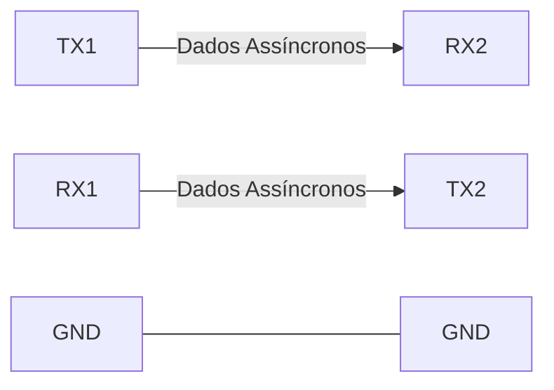
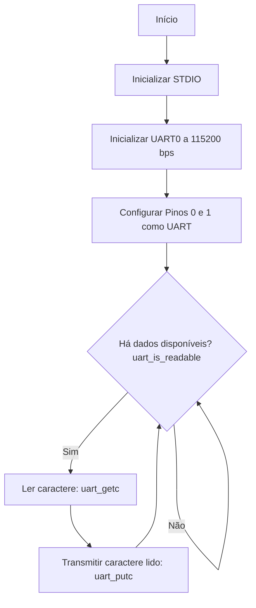
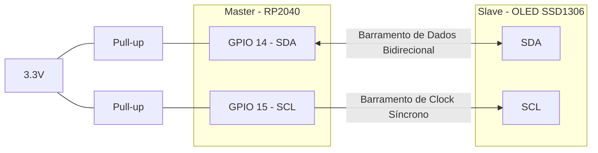
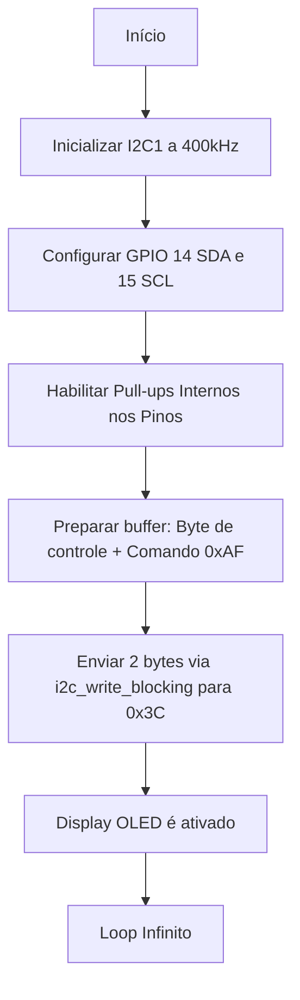
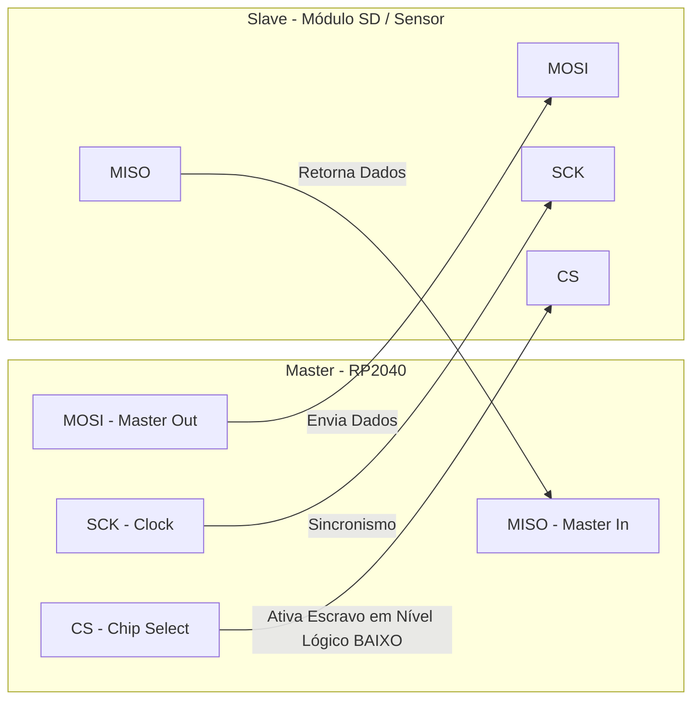
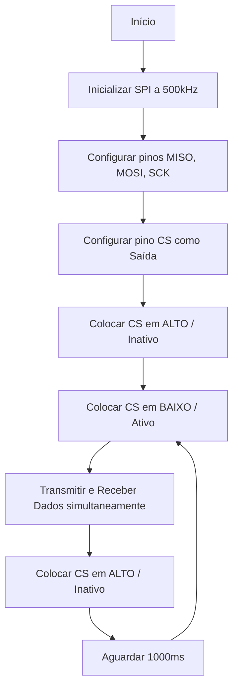

## Interfaces de Comunicação Serial com RP2040 e BitDogLab
### Mentoria Prática de Sistemas Embarcados
---

# Objetivos da Mentoria

##  O que vamos aprender hoje?

- Compreender os fundamentos das comunicações **UART, I2C e SPI**.
- Analisar códigos em **C/C++ (Pico SDK)** para cada protocolo.
- Visualizar o fluxo de execução dos programas e a arquitetura de rede.
- Demonstrar o funcionamento na prática usando os componentes reais da **BitDogLab**.

---

#  Introdução à Comunicação Serial

## Por que usar Comunicação Serial?

A comunicação serial transmite dados **bit a bit** sequencialmente por um ou dois fios, ao contrário da paralela, que transmite vários bits simultaneamente.

**Vantagens:**
- Menos pinos do microcontrolador utilizados.
- Menor complexidade no roteamento da placa.
- Excelente para comunicação entre microcontroladores e periféricos (Displays, Sensores, Módulos Bluetooth/Wi-Fi).

---

# Conhecendo a BitDogLab

## Onde estão os componentes na nossa placa?

A nossa **BitDogLab** (baseada no RP2040) possui periféricos incríveis já integrados:
- **Display OLED SSD1306 (I2C):** Conectado aos pinos **GPIO 14 (SDA)** e **GPIO 15 (SCL)**.
- **Matriz de 25 LEDs WS2812B:** Conectados em série no pino **GPIO 7** (Controlados via PIO do RP2040).
- **Portas de Expansão:** Permitem conectar módulos externos utilizando **UART** e **SPI**.
- **Conexão USB:** Uma UART virtual para debugar com o PC.

---

# UART (Universal Asynchronous Receiver/Transmitter)

##  Protocolo UART
A UART é **assíncrona** (não possui pino de clock). Excelente para enviar comandos do PC para a placa.

**Esquema de Conexão Física:**

*Observação: RX liga no TX, e TX liga no RX. Ambos devem estar na mesma velocidade (Baud Rate).*

---

# Exemplo UART - "Echo" com Pico SDK

Neste exemplo, a placa recebe um caractere do PC e o devolve. Utilizaremos os pinos GPIO 0 (TX) e GPIO 1 (RX).

```c
#include <stdio.h>
#include "pico/stdlib.h"
#include "hardware/uart.h"

#define UART_ID uart0
#define BAUD_RATE 115200
#define UART_TX_PIN 0
#define UART_RX_PIN 1

int main() {
    stdio_init_all();
    uart_init(UART_ID, BAUD_RATE);
    gpio_set_function(UART_TX_PIN, GPIO_FUNC_UART);
    gpio_set_function(UART_RX_PIN, GPIO_FUNC_UART);

    while (1) {
        if (uart_is_readable(UART_ID)) {
            char c = uart_getc(UART_ID); // Lê o caractere
            uart_putc(UART_ID, c);       // Envia o caractere de volta ("Echo")
        }
    }
}
```

---

# Fluxograma do Código UART



---

# I2C (Inter-Integrated Circuit)

## Protocolo I2C
O I2C é um barramento **síncrono** ideal para conectar múltiplos dispositivos com apenas 2 fios usando endereços hexadecimais (Ex: OLED `0x3C`).

**Esquema de Conexão Física:**


---

# Exemplo I2C - Inicializando o Display OLED

Enviando comandos de configuração para o Display OLED SSD1306 presente na BitDogLab (GPIO 14 e 15).

```c
#include <stdio.h>
#include "pico/stdlib.h"
#include "hardware/i2c.h"

#define I2C_PORT i2c1
#define I2C_SDA 14
#define I2C_SCL 15
#define ENDERECO_OLED 0x3C

int main() {
    stdio_init_all();
    
    // OLEDs costumam suportar Fast Mode (400 kHz)
    i2c_init(I2C_PORT, 400 * 1000); 
    
    gpio_set_function(I2C_SDA, GPIO_FUNC_I2C);
    gpio_set_function(I2C_SCL, GPIO_FUNC_I2C);
    gpio_pull_up(I2C_SDA);
    gpio_pull_up(I2C_SCL);

    // Exemplo: Comando para ligar o display (Display ON = 0xAF)
    uint8_t comando[2] = {0x00, 0xAF}; // 0x00 indica que o próximo byte é comando
    
    // Mestre envia 2 bytes para o OLED
    i2c_write_blocking(I2C_PORT, ENDERECO_OLED, comando, 2, false); 
    
    printf("Comando de inicialização enviado ao OLED na BitDogLab!\n");

    while (true) {
        tight_loop_contents(); 
    }
}
```

---

# Fluxograma do Código I2C (OLED)



---

# SPI (Serial Peripheral Interface)

## Protocolo SPI
Protocolo **síncrono** para altíssima velocidade. Utiliza 4 fios e ativação do escravo via pino CS.

**Esquema de Conexão Física:**


---

# Exemplo SPI - Leitura e Escrita Genérica

Código base para conectar um módulo SPI externo nos pinos de expansão.

```c
#include <stdio.h>
#include "pico/stdlib.h"
#include "hardware/spi.h"

#define SPI_PORT spi0
#define PIN_MISO 16
#define PIN_CS   17
#define PIN_SCK  18
#define PIN_MOSI 19

int main() {
    stdio_init_all();
    spi_init(SPI_PORT, 500000); // 500 kHz
    
    gpio_set_function(PIN_MISO, GPIO_FUNC_SPI);
    gpio_set_function(PIN_SCK, GPIO_FUNC_SPI);
    gpio_set_function(PIN_MOSI, GPIO_FUNC_SPI);
    
    // Configurar Chip Select via software
    gpio_init(PIN_CS);
    gpio_set_dir(PIN_CS, GPIO_OUT);
    gpio_put(PIN_CS, 1); // Desativa no início (Nível ALTO)

    uint8_t dado_envio = 0x80; 
    uint8_t dado_recebido;

    while (1) {
        gpio_put(PIN_CS, 0); // Ativa o módulo escravo (Nível BAIXO)
        spi_write_read_blocking(SPI_PORT, &dado_envio, &dado_recebido, 1);
        gpio_put(PIN_CS, 1); // Desativa o módulo
        
        printf("SPI Recebeu: %02X\n", dado_recebido);
        sleep_ms(1000);
    }
}
```

---

# Fluxograma do Código SPI



---

# Resumo e Comparativo

| Característica | UART | I2C | SPI |
| :--- | :--- | :--- | :--- |
| **Sincronismo** | Assíncrono | Síncrono (Clock) | Síncrono (Clock) |
| **Fios Mínimos** | 2 (TX, RX) | 2 (SDA, SCL) | 4 (MOSI, MISO, SCK, CS) |
| **Topologia** | 1 para 1 | Mestre - Multi Escravo | Mestre - Multi Escravo |
| **Na BitDogLab** | USB (Debug) / Header | **Display OLED (GPIO 14, 15)** | Headers de Expansão |

---

# Desafio Prático e Dúvidas

## Exercício de Integração BitDogLab
1. Receba um caractere 'L' via **UART** (Monitor Serial).
2. Quando receber 'L', escreva "LED ON" no **Display OLED via I2C**.
3. Em seguida, acenda a matriz de **LEDs WS2812B no GPIO7**.
